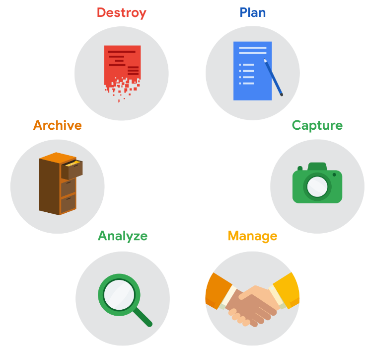

# GOOGLE DATA ANALYTICS

[Notion Version](https://www.notion.so/GOOGLE-DATA-ANALYTICS-e082e3eea7dd4dbaa209e978c51000b5)

- GLOSSARY
    
    Analysis: the process used to make sense of the data collected.
    
    Analytical skills: Qualities and characteristics associated with using facts to solve problems
    Analytical thinking: The process of identifying and defining a problem, then solving it by using data in an organized, step-by-step manner
    
    Big data: Large, complex datasets typically involving long periods of time, which enable data
    analysts to address far-reaching business problems
    
    Borders: Lines that can be added around two or more cells on a spreadsheet
    
    Business task: A business task is the question or problem data analysis answers for business.
    
    CASE statement: The CASE statement goes through one or more conditions and returns a value as soon as a condition is met.
    
    Cell reference: A cell or a range of cells in a worksheet typically used in formulas and functions.
    
    Changelog: a file containing a chronologically ordered list of modifications made to a project.
    
    Clean data: data that's complete, correct, and relevant to the problem you're trying to solve.
    
    Compatibility: how well two or more datasets are able to work together.
    
    CONCATENATE: a function that joins multiple text strings into a single string.
    
    Conditional formatting: a spreadsheet tool that changes how cells appear when values meet specific conditions.
    
    Confidence interval: The range of possible values that the population’s result would be at the confidence level of the study. This range is the sample result +/- the margin of error.
    
    Confidence level: How confident you are in the survey results. Confidence level is targeted before you start your study because it will affect how big your margin of error is at the end of your study.
    
    Context: The condition in which something exists or happens
    
    COUNTA: counts the total number of values within a specified range.
    
    COUNTIF: a function that returns the number of cells that match a specified value.
    
    CSV: Comma-separated values. A CSV file saves data in a table format
    
    Dashboard: A tool that monitors live, incoming data
    
    Data: A collection of facts
    Data analysis: The collection, transformation, and organization of data in order to draw
    conclusions, make predictions, and drive informed decision-making
    Data analyst: Someone who collects, transforms, and organizes data in order to drive
    informed decision-making
    Data analytics: The science of data
    
    Data elements: pieces of information, such as people's names, account numbers, and addresses
    
    Data integrity: is the accuracy, completeness, consistency, and trustworthiness of data throughout its lifecycle.
    
    Data model: A model that is used for organizing data elements and how they relate to one another.
    
    Database: A database is a collection of data stored in a computer system. When you maintain a database of customer information, ensuring data integrity, credibility, and privacy are all important concerns.
    Data-driven decision-making: Using facts to guide business strategy. Data-driven decision-making is when facts that have been discovered through data analysis are used to guide business strategy.
    Data ecosystem: The various elements that interact with one another in order to produce,
    manage, store, organize, analyze, and share data
    
    Data engineers: transform data into a useful format for analysis and give it a reliable infrastructure.
    
    Data mapping: the process of matching fields from one database to another.
    
    Data merging: the process of combining two or more datasets into a single dataset.
    Data science: A field of study that uses raw data to create new ways of modeling and understanding the unknown
    Dataset: A collection of data that can be manipulated or analyzed as one unit
    
    Data validation: a tool for checking the accuracy and quality of data before adding or importing it.
    
    Data warehousing specialist: develop processes and procedures to effectively store and organize data.
    
    Delimiter: a character that indicates the beginning or end of a data item.
    
    Deliverables:  are items or tasks you will complete before you can finish the project.
    
    Dirty data: data that's incomplete, incorrect, or irrelevant to the problem you're trying to solve.
    
    Documentation: the process of tracking changes, additions, deletions and errors involved in your data cleaning effort.
    
    Historical data: Data that already exist. We use this kind of data when you need an answer immediatly.
    
    Fairness: Fairness means ensuring that your analysis doesn't create or reinforce bias. In other words, as a data analyst, you want to help create systems that are fair and inclusive to everyone. Fairness also means crafting questions that make sense to everyone.
    
    Field: a single piece of information from a row or column of a spreadsheet.
    
    Field length: a tool for determining how many characters can be keyed into a field.
    
    Filtering: showing only the data that meets a specific criteria while hiding the rest.
    
    Find and replace: a tool that looks for a specified search term in a spreadsheet and allows you to replace it with something else.
    
    First-party data: Data collected by an individual or group using their own resources. It is typically the preferred method because you know exactly where it came from.
    
    Float: a number that contains a decimal
    
    Foreign key: a field within a table that is a primary key in another table.
    
    Formula: A set of instructions used to perform a calculation using the data in a spreadsheet
    Function: A preset command that automatically performs a specified process or task using the data in a spreadsheet
    
    Gap analysis: A method for examining and evaluating the current state of a process in order to identify opportunities for improvement in the future
    
    Header: The first row in a spreadsheet that labels the type of data in each column
    
    Hypothesis testing: is a way to see if a survey or experiment has meaningful results.
    
    Interoperability: the ability of data systems and services to openly connect and share data.
    
    Issue: An issue is a topic or subject to investigate.
    
    Leading question: A question that steers people toward a certain response
    
    LEFT: a function that gives you a set number of characters from the left side of a text string.
    
    LEN: a function that tells you the length of the text string by counting the number of characters it contains.
    
    Margin of error: Since a sample is used to represent a population, the sample’s results are expected to differ from what the result would have been if you had surveyed the entire population. This difference is called the margin of error. The smaller the margin of error, the closer the results of the sample are to what the result would have been if you had surveyed the entire population.
    
    Merge: an agreement that unites two organizations into a single new one.
    
    Metadata: is data about data.
    
    Metric goal: A metric goal is a measurable goal set by a company and evaluated using metrics. And just like there are a lot of possible metrics, there are lots of possible goals too.
    
    MID: a function that gives you a segment from the middle of a text string.
    
    Milestones: Milestones are significant tasks you will confirm along your timeline to help everyone know the project is on track.
    
    Null: an indication that a value does not exist in a data set. It is not the same as a zero.
    
    Outliers: are data points that are very different from similarly collected data and might not be reliable values.
    
    Pivot Table: A pivot table is a data summarization tool that is used in data processing. Pivot tables are used to summarize, sort, re-organize, group, count, total, or average data stored in a database. It allows its users to transform columns into rows and rows into columns.
    
    Population: all possible data values in a certain data set.
    
    Primary key: references a column in which each value is unique
    
    Problem: a problem is an obstacle or complication that needs to be worked out.
    
    Problem domain: the specific area of analysis that encompasses every activity affecting or affected by the problem.
    
    Problem types: The various problems that data analysts encounter, including categorizing
    things, discovering connections, finding patterns, identifying themes, making predictions, and
    spotting something unusual
    
    Quartile: A quartile divides data points into four equal parts or quarters.
    
    Query language: A computer programming language used to communicate with a database
    
    Question: A question is designed to discover information
    
    Random sampling: a way of selecting a sample from a population so that every possible type of the sample has an equal chance of being chosen.
    
    Reframing: Restating a problem or challenge, then redirecting it toward a potential resolution
    
    Relational database: a database that contains a series of tables that can be connected to form relationships.
    
    Reports: Reports notify everyone as you finalize deliverables and meet milestones.
    
    Revenue: The total amount of income generated by the sale of goods or services
    
    RIGHT: a function that gives you a set number of characters from the right side of a text string.
    
    Root cause: The reason why a problem occurs
    
    Sample: a part of a population that is representative of the population.
    
    Sampling bias: is when a sample isn’t representative of the population as a whole. This means some members of the population are being overrepresented or underrepresented.
    
    Schema: a way of describing how something is organized.
    
    Second-party data: data collected by a group directly from its audience and then sold.
    
    Syntax: a predetermined structure that includes all required information and its proper placement.
    
    SMART methodology: A tool for determining a question’s effectiveness based on whether it is
    specific, measurable, action-oriented, relevant, and time-bound
    
    Soft skills: non-technical traits and behaviors that relate to how you work.
    
    Sorting: arranging data into a meaningful order to make it easier to understand, analyze, and visualize.
    
    Sort sheet: All of the data in a spreadsheet is sorted by the ranking of a specific sorted column - data across rows is kept together.
    
    Sort range: Nothing else on the spreadsheet is rearranged besides the specified cells in a column.
    
    Split: a tool that divides a text string around the specified character and puts each fragment into a new and separate cell.
    
    Spreadsheet: A digital worksheet
    
    Statistical power: the probability of getting meaningful results from a test.
    
    Statistical significance: The determination of whether your result could be due to random chance or not. The greater the significance, the less due to chance.
    
    Stakeholders: People who have invested time and resources into a project and are interested in the outcome.
    
    Structured Query Language: A computer programming language used to communicate with a
    database
    Structured thinking: The process of recognizing the current problem or situation, organizing
    available information, revealing gaps and opportunities, and identifying options
    
    Technical mindset: The ability to break things down into smaller steps or pieces and work with them in an orderly and logical way
    
    Text string: a group of characters within a cell, most often composed of letters, numbers or both.
    
    Third-party data: Data collected from outside sources who did not collect it directly. This data might have come from a number of different sources before you investigated it. 
    
    Time-bound question: A question that specifies a timeframe to be studied
    
    Transferable skills: skills and qualities that can transfer from one job or industry to another.
    
    TRIM: a function that removes leading, trailing, and repeated spaces in data.
    
    Turnover rate: the rate at which employees leave a company.
    
    Typecasting: Converting data from one type to another.
    
    Unfair question: A question that makes assumptions or is difficult to answer honestly
    
    Verification: a process to confirm that a data cleaning effort was well- executed and the resulting data is accurate and reliable.
    
    VLOOKUP (stands for vertical lookup): a function that searches for a certain value in a column to return a corresponding piece of information.
    
- 1 - FOUNDATIONS
    
    ## INTRODUCTION
    
    "Data! Data! Data! I can't make bricks without clay." This line was said by Sherlock Holmes, the famous detective created by Sir Arthur Conan Doyle. What Doyle meant was that Holmes couldn't draw any conclusions, which would be the bricks he mentioned without data, or the clay.
    Data is basically a collection of facts or information, and through analysis, you'll learn how to use the data to draw conclusions, and make predictions, and decisions.
    
    Phases of the data analysis process: Ask, prepare, process, analyze, share, and act.
    
    Data analysis is the collection, transformation, and organization of data in order to draw conclusions, make predictions, and drive informed decision-making.
    
    **People analytics:** is the practice of collecting and analyzing data on the people who make up a company’s workforce in order to gain insights to improve how the company operates.
    
    Being a people analyst involves using data analysis to gain insights about employees and how they experience their work lives. The insights are used to define and create a more productive and empowering workplace. This can unlock employee potential, motivate people to perform at their best, and ensure a fair and inclusive company culture.
    
    ### Steps of the data analysis process:
    
    1. **Ask** questions and define the problem.: Ask effective questions to define what the project would look like and what would qualify as a succesful result. The analysts asked questions to define both the issue to be solved and what would equal a successful result.
    2. **Prepare** data by collecting and storing the information.: solid preparation. Build a timeline. Also, we need to identify what data we need to achieve the succesful result we identified in the previous step
    3. **Process** data by cleaning and checking the information.: Great analysts know how to respect both their data and the people who provide it. The data analysts also made sure employees understood how their data would be collected, stored, managed, and protected. Collecting and using data ethically is one of the responsibilities of data analysts. They processed the data by cleaning it to make sure it was complete, correct, relevant, and free of errors and outliers.
    4. **Analyze** data to find patterns, relationships, and trends.: here you will discover and document what the analyst found  in the analysis
    5. **Share** data with your audience.: Just as they made sure the data was carefully protected, the analysts were also careful **sharing the report.** This process gave managers an opportunity to **communicate the results** with the right context. As a result, they could have productive team conversations about next steps to improve employee engagement.
    6. **Act** on the data and use the analysis results.: to work with leaders within their company and decide how best to **implement changes and take actions** based on the findings.
    
    **Decision Intelligence:** is a combination of applied data science and the social and managerial sciences. It is all about harnessing the power and beauty of data.
    
    Data science, the discipline of making data useful, is an umbrella term that encompasses three disciplines: machine learning, statistics, and analytics.
    
    - Statistics: if you want to make a few important decisions under uncertainty. Statisticians are essentially philosophers, epistemologists. They are very, very careful about protecting decision-makers from coming to the wrong conclusion.
    - Machine learning and AI: If you want to automate, in other words, make many, many, many decisions under uncertainty. Performance is the excellence of the machine learning and AI engineer.
    - Analytics: You want to encounter your unknown unknowns. You want to understand your world. The excellence of an analyst is speed. Don't worry about right answers. See how quickly you can unwrap this gift and find out if there is anything fun in there.
    
    ## DATA ECOSYSTEM
    
    An ecosystem is a group of elements that interact with one another. Ecosystems can be large, like the jungle in a tropical rainforest or the Australian outback. Or, tiny, like tadpoles in a puddle, or bacteria on your skin. Data lives inside its own ecosystem too.
    
    Data ecosystems are made up of various elements that interact with one another in order to produce, manage, store, organize, analyze, and share data. These elements include hardware and software tools, and the people who use them. Data can also be found in something called the cloud.
    
    **The cloud:** The cloud is a place to keep data online, rather than on a computer hard drive. So instead of storing data somewhere inside your organization's network, that data is accessed over the internet. So the cloud is just a term we use to describe the virtual location. The cloud plays a big part in the data ecosystem
    
    | Data Scientist | Data Analyst |
    | --- | --- |
    | Data science is defined as creating new ways of modeling and understanding the unknown by using raw data. | When you think about data, data analysis and the data ecosystem, it's important to understand that all of these things fit under the data analytics umbrella. |
    | Data scientists create new questions using data | Analysts find answers to existing questions by creating insights from data sources. |
    
    **Data Analysis:** is the collection, transformation, and organization of data in order to draw conclusions, make predictions, and drive informed decision-making.
    
    **Data analytics:** is the science of data.
    
    ### DATA-DRIVEN-DECISION-MAKING
    
    it is defined as using facts to guide business strategy. Organizations in many different industries are empowered to make better, data-driven decisions by data analysts all the time.
    
    **Steps:**
    
    1. Figuring out the business need: Usually this is a problem that needs to be solved
    2. Whatever the problem is, once it's defined, a data analyst finds data, analyzes it and uses it to uncover trends, patterns and relationships.
    
    Data-driven decision-making can be so powerful, it can make entire business methods obsolete.
    
    By ensuring that data is built into every business strategy, data analysts play a critical role in their companies' success, but it's important to note that no matter how valuable data-driven decision-making is, data alone will never be as powerful as data combined with human experience, observation, and sometimes even intuition.
    
    To get the most out of data-driven decision-making, it's important to include insights from people who are familiar with the business problem. These people are called **subject matter experts**, and they have the ability to look at the results of data analysis and identify any inconsistencies, make sense of gray areas, and eventually validate choices being made.
    
    ## DATA AND GUT INSTINCT
    
    Detectives and data analysts have a lot in common. Your job is all about following steps to collect and understand facts.
    
    Analysts use data-driven decision-making and follow a step-by-step process, but there are other factors that influence the decision-making process. Gut instinct is an intuitive understanding of something with little or no explanation. This isn’t always something conscious; we often pick up on signals without even realizing. You just have a “feeling” it’s right.
    
    ### Why gut instinct can be a problem
    
    - If you ignore data by preferring to make decisions based on your own experience, your decisions may be biased
    - Decisions based on gut instinct without any data to back them up can cause mistakes.
    
    **Data + business knowledge = mystery solved**
    
    The key is figuring out the exact mix for each particular project. A lot of times, it will depend on the goals of your analysis. That is why analysts often ask, “How do I define success for this project?”
    
    In addition, try asking yourself these questions about a project to help find the perfect balance:
    
    - What kind of results are needed?
    - Who will be informed?
    - Am I answering the question being asked?
    - How quickly does a decision need to be made?
    
    ## ORIGINS OF THE DATA ANALYSIS PROCESS
    
    Data analysis is rooted in statistics, which has a pretty long history itself. Archaeologists mark the start of statistics in ancient Egypt with the building of the pyramids. The ancient Egyptians were masters of organizing data. They documented their calculations and theories on papyri (paper-like materials), which are now viewed as the earliest examples of spreadsheets and checklists. Today’s data analysts owe a lot to those brilliant scribes, who helped create a more technical and efficient process.
    
    ### Data analysis life cycle
    
    The process of going from data to decision. There might not be one single architecture that’s uniformly followed by every data analysis expert, but there are some shared fundamentals in every data analysis process.
    
    The process presented as part of the Google Data Analytics Certificate is one that will be valuable to you as you keep moving forward in your career:
    
    1. **Ask**: Business Challenge/Objective/Question
    2. **Prepare**: Data generation, collection, storage, and data management
    3. **Process**: Data cleaning/data integrity
    4. **Analyze**: Data exploration, visualization, and analysis
    5. **Share**: Communicating and interpreting results
    6. **Act**: Putting your insights to work to solve the problem
    
    
    
    ### EMC's data analysis life cycle
    
    EMC Corporation's data analytics life cycle is cyclical with six steps:
    
    1. Discovery
    2. Pre-processing data
    3. Model planning
    4. Model building
    5. Communicate results
    6. Operationalize
    
    EMC Corporation is now Dell EMC. This model, created by David Dietrich, reflects the cyclical nature of real-world projects.
    
    ### SAS's iterative life cycle
    
    An iterative life cycle was created by a company called **SAS**, a leading data analytics solutions provider. It can be used to produce repeatable, reliable, and predictive results:
    
    1. Ask
    2. Prepare
    3. Explore
    4. Model
    5. Implement
    6. Act
    7. Evaluate
    
    it includes a step after the act phase designed to help analysts evaluate their solutions and potentially return to the ask phase again.
    
    ### Project-based data analytics life cycle
    
    1. Identifying the problem
    2. Designing data requirements
    3. Pre-processing data
    4. Performing data analysis
    5. Visualizing data
    
    This data analytics project life cycle was developed by Vignesh Prajapati. It doesn’t include the sixth phase, or what we have been referring to as the Act phase.
    
    ### Big data analytics life cycle
    
    Authors Thomas Erl, Wajid Khattak, and Paul Buhler proposed a big data analytics life cycle in their book, **Big Data Fundamentals: Concepts, Drivers & Techniques**. Their life cycle suggests phases divided into nine steps:
    
    1. Business case evaluation
    2. Data identification
    3. Data acquisition and filtering
    4. Data extraction
    5. Data validation and cleaning
    6. Data aggregation and representation
    7. Data analysis
    8. Data visualization
    9. Utilization of analysis results
    
    It emphasizes the individual tasks required for gathering, preparing, and cleaning data before the analysis phase.
    
    ## ANALYTICAL SKILLS
    
    Analytical skills are qualities and characteristics associated with solving problems using facts. We will focus on 5 essential points or aspects:
    
    1. Curiosity. Is all about wanting to learn something. Curious people usually seek out new challenges and experiences. This leads to knowledge.
    2. Understanding context. Context is the condition in which something exists or happens. This can be a structure or an environment. Listening and trying to understand the full picture is critical.
    3. having a technical mindset. A technical mindset involves the ability to break things down into smaller steps or pieces and work with them in an orderly and logical way. When you take something that seems like a single task, like paying your bills, and break it into smaller steps with an orderly process, that's using a technical mindset.
    4. Data design. Data design is how you organize information. As a data analyst, design typically has to do with an actual database.
    5. Data strategy. Data strategy is the management of the people, processes, and tools used in data analysis.
    
    ## THINKING ANALYTICALLY
    
    Analytical thinking involves identifying and defining a problem and then solving it by using data in an organized, step-by-step manner.
    
    ### The five key aspects of analytical thinking:
    
    1. Visualization: is the graphical representation of information. For example, graphs, maps or design elements. Visualization is important because visuals can help data analysts understand and explain information more effectively.
    2. Strategy: Strategizing helps data analysts see what they want to achieve with the data and how they can get there. Strategy also helps improve the quality and usefulness of the data we collect. By strategizing, we know all our data is valuable and can help us accomplish our goals.
    3. Problem-orientation: Data analysts use a problem- oriented approach in order to identify, describe, and solve problems. It's all about keeping the problem top of mind throughout the entire project. Data analysts also ask a lot of questions. This helps improve communication and saves time while working on a solution.
    4. Correlation: being able to identify a correlation between two or more pieces of data. A correlation is like a relationship. You can find all kinds of correlations in data. Correlation does not equal causation. In other words, just because two pieces of data are both trending in the same direction, that doesn't necessarily mean they are all related.
    5. big-picture and detail-oriented thinking: This means being able to see the big picture as well as the details. Big-picture thinking is like looking at a complete puzzle. You can enjoy the whole picture without getting stuck on every tiny piece that went into making it. If you only focus on individual pieces, you wouldn't be able to see past that, which is why big-picture thinking is so important. It helps you zoom out and see possibilities and opportunities. This leads to exciting new ideas or innovations. On the flip side, detail-oriented thinking is all about figuring out all of the aspects that will help you execute a plan. In other words, the pieces that make up your puzzle.
    
    The more ways you can think, the easier it is to think outside the box and come up with fresh ideas. But why is it important to think in different ways? in data analysis, solutions are almost never right in front of you. You need to think **critically** to find out the right questions to ask. But you also need to think **creatively** to get new and unexpected answers.
    
    Some of the questions data analysts ask when they're on the hunt for a solution are:
    
    - What is the root cause of a problem?. A root cause is the reason why a problem occurs. If we can identify and get rid of a root cause, we can prevent that problem from happening again. A simple way to wrap your head around root causes is with the process called the Five Whys.
    - where are the gaps in our process?. For this, many people will use something called gap analysis. Gap analysis lets you examine and evaluate how a process works currently in order to get where you want to be in the future. The general approach to gap analysis is understanding where you are now compared to where you want to be. Then you can identify the gaps that exist between the current and future state and determine how to bridge them.
    - what did we not consider before?. This is a great way to think about what information or procedure might be missing from a process, so you can identify ways to make better decisions and strategies moving forward.
    
    ### Five Whys:
    
    you ask "why" five times to reveal the root cause. The fifth and final answer should give you some useful and sometimes surprising insights.
    
    The way data analysts think and ask questions plays a big part in how businesses make decisions. That's why analytical thinking and understanding how to ask the right questions can have such a huge impact on the overall success of a business.
    
    ## USING DATA TO DRIVE SUCCESSFUL OUTCOMES
    
    ### Data-driven decision-making:
    
    It gives you greater confidence about your choice and your abilities to address business challenges. It helps you become more proactive when an opportunity presents itself, and it saves you time and effort when working towards a goal.
    
    First, think about curiosity and context. The more you learn about the power of data, the more curious you're likely to become. You'll start to see patterns and relationships in everyday life
    
    The analysts take their thinking a step further by using context to make predictions, research answers, and eventually draw conclusions about what they've discovered. This natural process is a great first step in becoming more data-driven. Having a technical mindset comes next.
    
    Data analysts have gut feeling, but they've trained themselves to build on those feelings and use a more technical approach to explore them. They do this by always seeking out the facts, putting them to work through analysis, and using the insights they gain to make informed decisions.
    
    Next, we come to data design, which has a strong connection to data-driven decision-making. Designing your data so that it is organized in a logical way makes it easy for data analysts to access, understand, and make the most of available information. And it's important to keep in mind that data design doesn't just apply to databases. This kind of thinking can work with all sorts of real-life situations too.
    
    The basic idea is: If you make decisions that are informed by data, you are more likely to make more informed and effective decisions.
    
    The final ability is data strategy, which incorporates the people, processes, and tools used to solve a problem. This is a big one to remember because data strategy gives you a high-level view of the path you need to take to achieve your goals.
    
    data strategy gives you a high-level view of the path you need to take to achieve your goals. Also, data-driven decision-making isn't a one-person job. It's much more likely to be successful if everyone is on board and on the same page, so it's important to make sure specific procedures are in place and that your technology being used is aligned with your data-driven strategy.
    
    ## DATA LIFE CYCLE
    
    The data life cycle starts with the right data analysis tools. These include spreadsheets, databases, query languages, and visualization software. 
    
    The life cycle of data is plan, capture, manage, analyze, archive and destroy.
    
    1. **Planning:** This actually happens well before starting an analysis project. During planning, a business decides what kind of data it needs, how it will be managed throughout its life cycle, who will be responsible for it, and the optimal outcomes.
    2. **Capture:** This is where data is collected from a variety of different sources and brought into the organization. With so much data being created everyday, the ways to collect it are truly endless. One common method is getting data from outside resources. Another way to get data is from a company's own documents and files, which are usually stored inside a database.
    3. **Manage:** how we care for our data, how and where it's stored, the tools used to keep it safe and secure, and the actions taken to make sure that it's maintained properly. This phase is very important to data cleansing.
    4. **Analyze:** In this phase, the data is used to solve problems, make great decisions, and support business goals.
    5. **Archive:** Keep relevant data stored for long-term and future reference. Archiving means storing data in a place where it's still available, but may not be used again. It makes way more sense to archive it than to keep it around.
    6. **Destroy:** Remove data from storage and delete any shared copies of the data. To destroy it, the company would use a secure data erasure software. If there were any paper files, they would be shredded too. This is important for protecting a company's private information, as well as private data about its customers.
    
    ### Different ways to see the data life cycle:
    
    Although data life cycles vary, one data management principle is universal. Govern how data is handled so that it is accurate, secure, and available to meet your organization's needs.
    
    - U.S. Fish and Wildlife Service:
        1. Plan
        2. Acquire
        3. Maintain
        4. Access
        5. Evaluate
        6. Archive
    - The U.S. Geological Survey (USGS):
        1. Plan
        2. Acquire
        3. Process
        4. Analyze
        5. Preserve
        6. Publish/Share
    - Financial institutions:
        1. Capture
        2. Qualify
        3. Transform
        4. Utilize
        5. Report
        6. Archive
        7. Purge
    - Harvard Business School (HBS):
        1. Generation
        2. Collection
        3. Processing
        4. Storage
        5. Management
        6. Analysis
        7. Visualization
        8. Interpretation
    
    ## PHASES OF DATA ANALYSIS
    
    Data analysis isn't a life cycle. It's the process of analyzing data.
    
    1. **Ask:** In this phase, we do two things. We define the problem to be solved and we make sure that we fully understand stakeholder expectations. **Stakeholders** hold a stake in the project. They are people who have invested time and resources into a project and are interested in the outcome. First, defining a problem means you look at the current state and identify how it's different from the ideal state. Usually there's an obstacle we need to get rid of or something wrong that needs to be fixed. Another important part of the ask phase is understanding stakeholder expectations. The first step here is to determine who the stakeholders are. That may include your manager, an executive sponsor, or your sales partners. There can be lots of stakeholders. But what they all have in common is that they help make decisions, influence actions and strategies, and have specific goals they want to meet. This part of the ask phase helps you keep focused on the problem itself, not just its symptoms.
        
        You want to ask all of the right questions at the beginning of the engagement so that you better understand what your leaders and stakeholders need from this analysis.
        
        - what is the problem that we're trying to solve?
        - What is the purpose of this analysis?
        - What are we hoping to learn from it?
    2. **Prepare:** This is where data analysts collect and store data they'll use for the upcoming analysis process. Any decisions made from your analysis should always be based on facts and be fair and impartial.
        
        We need to be thinking about the type of data we need in order to answer the questions that we've set out to answer based on what we learned when we asked the right questions. We also need to be thinking about how we're going to collect that data or if we need to collect that data.
        
    3. **Process:** Here, data analysts find and eliminate any errors and inaccuracies that can get in the way of results. This usually means cleaning data, transforming it into a more useful format, combining two or more datasets to make information more complete and removing outliers, which are any data points that could skew the information. This phase is all about getting the details right. So you'll also fix typos, inconsistencies, or missing and inaccurate data.
        
        This is where you get a chance to understand its structure, its quirks, its nuances, and you really get a chance to understand deeply what type of data you're going to be working with and understanding what potential that data has to answer all of your questions. we will be running through all of our quality assurance checks, for example:
        
        - do we have all of the data that we anticipated we would have?
        - Are we missing data at random or is it missing in a systematic way such that maybe something went wrong with our data collection effort?
        - If needed, did we code all of our data the right way?
        - Are there any outliers that we need to treat differently?
        
        This is the part where we spend a lot of time really digging deeply into the structure and nuance of the data to make sure that you're able to analyze it appropriately and responsibly.
        
    4. **Analyze:** Analyzing the data you've collected involves using tools to transform and organize that information so that you can draw useful conclusions, make predictions, and drive informed decision-making.
        
        This is the point where we have to take a step back and let the data speak for itself. As data analysts, we are storytellers, but we also have to keep in mind that it is not our story to tell. That story belongs to the data, and it is our job as analysts to amplify and tell that story in as unbiased and objective a way as possible.
        
    5. **Share:** Here you'll learn how data analysts interpret results and share them with others to help stakeholders make effective data-driven decisions. In the share phase, visualization is a data analyst's best friend.
    6. **Act:** This is the exciting moment when the business takes all of the insights you, the data analyst, have provided and puts them to work in order to solve the original business problem and will be acting on what you've learned throughout this program.
        
        This is where we use all of those data-driven insights to decide what types of interventions we want to introduce, not only at the organizational level, but also at the team level as well.
        
    
    
    
    ## THE DATA ANALYST TOOLS
    
    ### Spreadsheets:
    
    two popular options are Microsoft Excel and Google Sheets. A spreadsheet is a digital worksheet. It stores, organizes, and sorts data. When you put your data into a spreadsheet, you can see patterns, group information and easily find the information you need. Spreadsheets also have some really useful features called formulas and functions.
    
    Spreadsheets structure data in a meaningful way by letting you
    
    - Collect, store, organize, and sort information
    - Identify patterns and piece the data together in a way that works for each specific data project
    - Create excellent data visualizations, like graphs and charts.
    
    A formula is a set of instructions that performs a specific calculation using the data in a spreadsheet.
    
    A function is a preset command that automatically performs a specific process or task using the data in a spreadsheet. Functions can help make you more efficient.
    
    ### Query language
    
    A query language is a computer programming language that allows you to retrieve and manipulate data from a database.
    
    SQL is a language that lets data analysts communicate with a database. SQL is the most widely used structured query language for a couple of reasons:
    
    - Allow analysts to isolate specific information from a database(s)
    - Make it easier for you to learn and understand the requests made to databases
    - Allow analysts to select, create, add, or download data from a database for analysis
    
    With SQL, data analysts can access the data they need by making a query. A query means question, but it is more like a request.
    
    ### Data visualization
    
    Is the graphical representation of information. Some examples include graphs, maps, and tables. They help data analysts communicate their insights to others, in an effective and compelling way. This makes it easier for stakeholders to draw conclusions, make decisions, and come up with strategies. Also, these tools turn complex numbers into a story that people can understand. Some popular visualization tools are Tableau and Looker. Data analysts like using Tableau because it helps them create visuals that are very easy to understand. 
    
    A career as a data analyst also involves using programming languages, like R and Python, which are used a lot for statistical analysis, visualization, and other data analysis.
    
    Depending on which phase of the data analysis process you’re in, you will need to use different tools.
    
    
    
    You don’t have to choose one or the other because each serves its own purpose. Generally, data analysts work with a combination of the two, as both tools are very useful in data analytics.
    
    ## SPREADSHEET AND SQL
    
    Spreadsheets are a big part of data analytics.
    
    ### Three main features of a spreadsheet:
    
    - Cells: when you talk about a specific cell, you name it by combining the column letter and the row number where the cell is located.
    - Rows: the rows are organized horizontally and are ordered by number. A row is also called an observation. An observation includes all of the attributes for something contained in a row of a data table.
    - Columns: columns are organized vertically in a spreadsheet and are ordered by letter.
    
    
    
    ### Attribute
    
    Adding labels to the top of the columns will make it easier to reference and find data later on when you're doing analysis. These column labels are usually called attributes. An attribute is a characteristic or quality of data used to label a column in a table. More commonly, attributes are referred to as column names, column labels, headers, or the header row.
    
    ### Formula
    
    A formula is a set of instructions that performs a specific action using the data in a spreadsheet. To do this, the formula uses cell references for the values it's calculating. All formulas begin with =
    
    ### SQL
    
    Structured Query Language (or SQL, often pronounced “sequel”) enables data analysts to talk to their databases. Remember, SQL can do lots of the same things with data that spreadsheets can do. You can use it to store, organize and analyze your data, among other things. But like any good sequel, it's on a larger scale, bigger, more action-packed. SQL needs a database that will understand its language.
    
    **Query:** A query is a request for data or information from a database.
    
    ### Basic Structure of a SQL query:
    
    
    
    ### Syntax
    
    Every programming language, including SQL, follows a unique set of guidelines known as syntax. Syntax is the predetermined structure of a language that includes all required words, symbols, and punctuation, as well as their proper placement. As soon as you enter your search criteria using the correct syntax, the query starts working to pull the data you’ve requested from the target database.
    
    The syntax of every SQL query is the same:
    
    - Use **SELECT** to choose the columns you want to return. You can separate the columns with (,).
    - Use **FROM** to choose the tables where the columns you want are located.
    - Use **WHERE** to filter for certain information. You connect the conditions with (AND), (OR) or (NOT).
    
    
    
    The most important thing to remember is how to use SELECT, FROM, and WHERE in a query.
    
    ### SQL good practices - TIPS:
    
    - using capitalization and indentation can help you read the information more easily.
    - The semicolon is a statement terminator and is part of the American National Standards Institute (ANSI) SQL-92 standard, which is a recommended common syntax for adoption by all SQL databases. However, not all SQL databases have adopted or enforce the semicolon, so it’s possible you may come across some SQL statements that aren’t terminated with a semicolon. If a statement works without a semicolon, it’s fine.
    - the LIKE clause is very powerful because it allows you to tell the database to look for a certain pattern
    - The percent sign (%) is used as a wildcard to match one or more characters.
    - with SELECT * , you would be selecting all of the columns in the table, but be careful, selecting too much data can cause a query to run slowly.
    - You can place comments alongside your SQL to help you remember what the name represents. Comments are text placed between certain characters, /* and */, or after two dashes (--)
        - Comments can also be added outside of a statement as well as within a statement. You can use this flexibility to provide an overall description of what you are going to do, step-by-step notes about how you achieve it, and why you set different parameters/conditions.
        
        
        
    - We can assign alias to the columns to reduce the ammount of comments. An alias doesn’t change the actual name of a column or table in the database.
    - <> means "does not equal”
    - Pulling the data, analyzing it, and implementing a solution might ultimately help improve employee satisfaction and loyalty. That makes SQL a pretty powerful tool.
    
    ## DATA VISUALIZATION
    
    Because of the importance of data visualization, most data analytics tools (such as spreadsheets and databases) have a built-in visualization component while others (such as Tableau) specialize in visualization as their primary value-add.
    
    Data visualizations are pictures, they are a wonderful way to take very basic ideas around data and data points and make them come alive.
    
    ### Steps to plan a data visualization:
    
    1. Explore the data for patterns
    2. Plan your visuals
    3. Create your visuals
    
    Data visualization toolkit:
    
    - Spreadsheets: Microsoft Excel or Google Sheets
    - Visualization software: Tableau. Tableau is a popular data visualization tool that lets you pull data from nearly any system and turn it into compelling visuals or actionable insights. The platform offers built-in visual best practices, which makes analyzing and sharing data fast, easy, and (most importantly) useful.
    - Programming language: R with RStudio. As with Tableau, you can create dashboard-style data visualizations using RStudio.
    
    ## FAIRNESS
    
    Fairness means ensuring that your analysis doesn't create or reinforce bias. In other words, as a data analyst, you want to help create systems that are fair and inclusive to everyone.
    
    Sometimes conclusions based on data can be true and unfair.
    
    Most common factors: industry, tools, location, travel, and culture.
    
    The data analyst role is one of many job titles that contain the word “analyst.”
    
    - Business analyst — analyzes data to help businesses improve processes, products, or services
    - Data analytics consultant — analyzes the systems and models for using data
    - Data engineer — prepares and integrates data from different sources for analytical use
    - Data scientist — uses expert skills in technology and social science to find trends through data analysis
    - Data specialist — organizes or converts data for use in databases or software systems
    - Operations analyst — analyzes data to assess the performance of business operations and workflows
    
    
    
    Other industry-specific specialist positions that you might come across in your data analyst job search include:
    
    - Marketing analyst — analyzes market conditions to assess the potential sales of products and services
    - HR/payroll analyst — analyzes payroll data for inefficiencies and errors
    - Financial analyst — analyzes financial status by collecting, monitoring, and reviewing data
    - Risk analyst — analyzes financial documents, economic conditions, and client data to help companies determine the level of risk involved in making a particular business decision
    - Healthcare analyst — analyzes medical data to improve the business aspect of hospitals and medical facilities
    
    ### Interview best practices:
    
    - Think about a time where you've used data to solve a problem, whether it's in your professional or personal projects
    - increase your professional network.
    - It's really important to have your LinkedIn updated along with websites like GitHub, where you can showcase a lot of the data analysts projects you've done.
    - Prepare questions for the interviewer.
    - Sometimes there is no right answer, and a lot of times interviewers are looking to see your thought process and the way you get to your solution.
    - Look for the recruiter. Look for the hiring manager online. See if you can reach out to them and set up a coffee chat or send them your resume directly.
    
- 2 - **ASK** QUESTIONS TO MAKE DATA-DRIVEN DECISIONS
    
    This is related to the ASK part of the analysis phase
    
    **Structured thinking:** is the process of recognizing the current problem or situation, organizing available information, revealing gaps and opportunities, and identifying the options. In this process, you address a vague, complex problem by breaking it down into smaller steps, and then those steps lead you to a logical solution.
    
    key things to think about when choosing an advertising method:
    
    1. your target audience.
    2. your budget
    
    Take action with data:
    
    1. Zoom out and look at the whole situation in context. That way we can be sure that she was focusing on the real problem and not just its symptoms.
    2. Collaborating with stakeholders and understanding their needs. Takeholders included the owner, the vice president of communications, and the director of marketing and finance.
    3. Prepare phase, where we collect the data for the upcoming analysis process. Here we have to understand the company’s target audience, collect the data to look for patterns.
    4. Process step. Clean the data to eliminate any errors or inaccuracies that could get in the way of the result. When you clean data, you transform it into a more useful format, create more complete information and remove outliers.
    5. Analyze. 
    6. Share the recommendation so the company could make a data driven decision. summarize the results using clear and compelling visuals of the analysis. This helped her stakeholders understand the solution to the original problem.
    
    ## THE SIX DATA ANALYSIS PHASES
    
    There are six data analysis phases that will help you make seamless decisions: ask, prepare, process, analyze, share, and act. Keep in mind, these are different from the data life cycle, which describes the changes data goes through over its lifetime.
    
    ### Step 1: Ask.
    
    It’s impossible to solve a problem if you don’t know what it is. These are some things to consider:
    
    - Define the problem you’re trying to solve
    - Make sure you fully understand the stakeholder’s expectations
    - Focus on the actual problem and avoid any distractions
    - Collaborate with stakeholders and keep an open line of communication
    - Take a step back and see the whole situation in context
        
        **Questions to ask yourself in this step:**
        
        1. What are my stakeholders saying their problems are?
        2. Now that I’ve identified the issues, how can I help the stakeholders resolve their questions?
    
    ### Step 2: Prepare.
    
    You will decide what data you need to collect in order to answer your questions and how to organize it so that it is useful. You might use your business task to decide:
    
    - What metrics to measure
    - Locate data in your database
    - Create security measures to protect that data
        
        **Questions to ask yourself in this step:**
        
        1. What do I need to figure out how to solve this problem?
        2. What research do I need to do?
        
    
    ### Step 3: Process.
    
    Clean data is the best data and you will need to clean up your data to get rid of any possible errors, inaccuracies, or inconsistencies. This might mean:
    
    - Using spreadsheet functions to find incorrectly entered data
    - Using SQL functions to check for extra spaces
    - Removing repeated entries
    - Checking as much as possible for bias in the data
        
        **Questions to ask yourself in this step:**
        
        1. What data errors or inaccuracies might get in my way of getting the best possible answer to the problem I am trying to solve?
        2. How can I clean my data so the information I have is more consistent?
    
    ### Step 4: Analyze
    
    You will want to think analytically about your data. At this stage, you might sort and format your data to make it easier to:
    
    - Perform calculations
    - Combine data from multiple sources
    - Create tables with your results
        
        **Questions to ask yourself in this step:**
        
        1. What story is my data telling me?
        2. How will my data help me solve this problem?
        3. Who needs my company’s product or service? What type of person is most likely to use it?
    
    ### Step 5: Share.
    
    Everyone shares their results differently so be sure to summarize your results with clear and enticing visuals of your analysis using data via tools like graphs or dashboards. This is your chance to show the stakeholders you have solved their problem and how you got there. Sharing will certainly help your team:
    
    - Make better decisions
    - Make more informed decisions
    - Lead to stronger outcomes
    - Successfully communicate your findings
        
        **Questions to ask yourself in this step:**
        
        1. How can I make what I present to the stakeholders engaging and easy to understand?
        2. What would help me understand this if I were the listener?
    
    ### Step 6: Act.
    
    Now it’s time to act on your data. You will take everything you have learned from your data analysis and put it to use. This could mean providing your stakeholders with recommendations based on your findings so they can make data-driven decisions.
    
    **Questions to ask yourself in this step:**
    
    1. How can I use the feedback I received during the share phase (step 5) to actually meet the stakeholder’s needs and expectations?
    
    These six steps can help you to break the data analysis process into smaller, manageable parts, which is called **structured thinking**. This process involves four basic activities:
    
    1. Recognizing the current problem or situation
    2. Organizing available information
    3. Revealing gaps and opportunities
    4. Identifying your options
    
    When you are starting out in your career as a data analyst, it is normal to feel pulled in a few different directions with your role and expectations. Following processes like the ones outlined here and using structured thinking skills can help get you back on track, fill in any gaps and let you know exactly what you need.
    
    ### SOLVE PROBLEMS WITH DATA
    
    Data analysts work with a variety of problems. There are 6 common problem types:
    
    1. **making predictions:** involves using data to make an informed decision about how things may be in the future
        - Problem: how to determine the best advertising method for anywhere gaming repair's target audience. nobody can see the future but the data helped them make an informed decision about how things would likely work out.
    2. **categorizing things:** assigning information to different groups or clusters based on common features.
        - Problem: How to improve customer satisfaction levels. Analysts might classify customer service calls based on certain keywords or scores. They could identify certain key words or phrases that come up during the phone calls and then assign them to categories such as politeness, satisfaction, dissatisfaction, empathy, and more. Categorizing these key words gives us data that lets the company identify top performing customer service representatives, and those who might need more coaching.
    3. **spotting something unusual:** In this problem type, data analysts identify data that is different from the norm.
        - Analysts who have analyzed aggregated health data can help product developers determine the right algorithms to spot and set off alarms when certain data doesn't trend normally.
    4. **identifying themes:** Identifying themes takes categorization as a step further by grouping information into broader concepts.
        - Problem: How to improve users experience.
        - Themes are most often used to help researchers explore certain aspects of data. In a user study, user beliefs, practices, and needs are examples of themes.
        - The process here is kind of like finding categories for keywords and phrases in customer service conversations.
    5. **discovering connections:** enables data analysts to find similar challenges faced by different entities, and then combine data and insights to address them.
        - Problem: How to reduce wait time.
        - A third-party logistics company working with another company to get shipments delivered to customers on time is a problem requiring analysts to discover connections. By analyzing the wait times at shipping hubs, analysts can determine the appropriate schedule changes to increase the number of on-time deliveries.
    6. **Finding patterns:** Data analysts use data to find patterns by using historical data to understand what happened in the past and is therefore likely to happen again.
        - Problem: how to stop machines from breaking down.
        - Minimizing downtime caused by machine failure is an example of a problem requiring analysts to find patterns in data. For example, by analyzing maintenance data, they might discover that most failures happen if regular maintenance is delayed by more than a 15-day window.
    
    ## CRAFT EFFECTIVE QUESTIONS
    
    The more questions you ask, the more you'll learn about your data and the more powerful your insights will be at the end of the day. Knowing the difference between effective and ineffective questions is essential for your future career as a data analyst.
    
    ### Things to avoid when asking questions:
    
    - Leading questions: it's leading you to answer in a certain way
    - Closed-ended questions: questions that ask for a one-word or brief response only. These kinds of questions rarely lead to valuable insights. It's too vague and lacks context.
    - Vague questions: questions that aren’t specific or don’t provide context.
    
    ### Effective questions follow the SMART methodology.
    
    - S: Specific. Specific questions are simple, significant and focused on a single topic or a few closely related ideas. This helps us collect information that's relevant to what we're investigating. If a question is too general, try to narrow it down by focusing on just one element.
    - M: Measurable. Measurable questions can be quantified and assessed.
    - A: Action-oriented. Action-oriented questions encourage change. This brings you answers you can act on
    - R: Relevant. Relevant questions matter, are important and have significance to the problem you're trying to solve.
    - T: Time-bound. Time-bound questions specify the time to be studied. This limits the range of possibilities and enables the data analyst to focus on relevant data
    
    
    
    Questions should be open-ended. This is the best way to get responses that will help you accurately qualify or disqualify potential solutions to your specific problem.
    
    ## UNDERSTAND THE POWER OF DATA - data-inspired decision-making - Quantitive and qualitative data
    
    Data-inspired decision-making explores different data sources to find out what they have in common.
    
    An algorithm is a process or set of rules to be followed for a specific task.
    
    Responsibly gathering data is only part of the process. We also have to turn data into knowledge that helps us make better solutions.
    
    
    
    The goal of all data analysts is to use data to draw accurate conclusions and make good recommendations. That all starts with having complete, correct, and relevant data.
    
    - **When data is interpreted incorrectly, it can lead to huge losses.**
    - **When data is used strategically, businesses can transform and grow their revenue.**
    
    As a data analyst, your own skills and knowledge will be the most important part of any analysis project. It is important for you to keep a data-driven mindset, ask lots of questions, experiment with many different possibilities, and use both logic and creativity along the way. You will then be prepared to interpret your data with the highest levels of care and accuracy.
    
    Analyzing user preferences to customize movie recommendations and analyzing product purchases to create better promotions are examples of using data to achieve business results.
    
    There are 2 kinds of data:
    
    ### Quantitative data
    
    Quantitative data is all about the specific and objective measures of numerical facts. This can often be the what, how many, and how often about a problem. In other words, things you can measure.
    
    Quantitative data is a specific and objective measure, such as a number, quantity or range.
    
    With quantitative data, we can see numbers visualized as charts or graphs.
    
    Tools:
    
    - Structured interviews
    - Surveys
    - Polls
    
    ### Qualitative data
    
    qualitative data describes subjective or explanatory measures of qualities and characteristics or things that can't be measured with numerical data. Qualitative data is great for helping us answer why questions.
    
    Qualitative data can then give us a more high-level understanding of why the numbers are the way they are.
    
    **Tools:**
    
    - Focus groups
    - Social media text analysis
    - In-person interviews
    
    It's your job as a data detective to know which questions to ask to find the right solution. Then you can start thinking about cool and creative ways to help stakeholders better understand the data.
    
    Usually, qualitative data can help analysts better understand their quantitative data by providing a reason or more thorough explanation. In other words, quantitative data generally gives you the what, and qualitative data generally gives you the why.
    
    ## FOLLOW THE EVIDENCE - metrics, reports, dashboards
    
    here are all kinds of tools out there to help you visualize and share your data analysis with stakeholders. Here, we'll talk about two data presentation tools, reports and dashboards. Reports and dashboards are both useful for data visualization. But there are pros and cons for each of them.
    
    ### Reports
    
    A report is a static collection of data given to stakeholders periodically.
    
    | pros | cons |
    | --- | --- |
    | Reports are great for giving snapshots of high level historical data for an organization. | Reports need regular maintenance. |
    | They can be designed and sent out periodically, often on a weekly or monthly basis, as organized and easy to reference information. | They are not very visually appealing. |
    | They're quick to design and easy to use as long as you continually maintain them. | Because they aren't automatic or dynamic, reports don't show live, evolving data. |
    | Because reports use static data or data that doesn't change once it's been recorded, they reflect data that's already been cleaned and sorted. |  |
    
    ### Dashboards
    
    A dashboard monitors live, incoming data.
    
    Data analysts use dashboards to track, analyze, and visualize data in order to answer questions and solve problems.
    
    | Pros | Cons |
    | --- | --- |
    | they give your team more access to information being recorded, you can interact through data by playing with filters, and because they're dynamic, they have long-term value. | they take a lot of time to design |
    | If stakeholders need to continually access information, a dashboard can be more efficient than having to pull reports over and over | can actually be less efficient than reports, if they're not used very often. (can be confusing). |
    | Nice to look at | If the base table breaks at any point, they need a lot of maintenance to get back up and running again. |
    | A dashboard organizes information from multiple datasets into one central location, offering huge time-savings. | Dashboards can sometimes overwhelm people with information too. |
    
    
    
    ### How to create a Dashboard:
    
    1. Identify the stakeholders who need to see the data and how they will use it: To get started with this, you need to ask effective questions. Check out the PDF.
    2. Design the dashboard (what should be displayed): Use these tips to help make your dashboard design clear, easy to follow, and simple:
        - Use a clear header to label the information
        - Add short text descriptions to each visualization
        - Show the most important information at the top
    3. Create mock-ups if desired: This is optional, but a lot of data analysts like to sketch out their dashboards before creating them.
    4. Select the visualizations you will use on the dashboard: it all depends on what data story you are telling. If you need to show a change of values over time, line charts or bar graphs might be the best choice. If your goal is to show how each part contributes to the whole amount being reported, a pie or donut chart is probably a better choice.
    5. Create filters as needed.
    
    ### Types of dashboards:
    
    The three most common categories are:
    
    - **Strategic**: focuses on long term goals and strategies at the highest level of metrics. A wide range of businesses use strategic dashboards when evaluating and aligning their strategic goals. These dashboards provide information over the longest time frame—from a single financial quarter to years.
    - **Operational:** short-term performance tracking and intermediate goals. It is the most common type of dashboard. Because these dashboards contain information on a time scale of days, weeks, or months, they can provide performance insight almost in real-time. This allows businesses to track and maintain their immediate operational processes in light of their strategic goals. The operational dashboard below focuses on customer service.
    
    
    
    - **Analytical:** consists of the datasets and the mathematics used in these sets. These dashboards contain the details involved in the usage, analysis, and predictions made by data scientists. Certainly the most technical category, analytic dashboards are usually created and maintained by data science teams and rarely shared with upper management as they can be very difficult to understand.
    
    
    
    ### Data VS Metrics
    
    Data starts as a collection of raw facts, until we organize them into individual metrics that represent a single type of data.
    
    | Data | Metrics |
    | --- | --- |
    | Data contains a lot of raw details about the problem we're exploring. | A metric is a single, quantifiable type of data that can be used for measurement. |
    |  | Metrics can also be combined into formulas that you can plug your numerical data into. Metrics usually involve simple math. |
    
    We see metrics used in marketing too. For example, metrics can be used to help calculate customer retention rates, or a company's ability to keep its customers over time. Customer retention rates can help the company compare the number of customers at the beginning and the end of a period to see their retention rates.
    
    By using metrics to focus on individual aspects of your data, you can start to see the story your data is telling. Metric goals and formulas are great ways to measure and understand data.
    
    ### ROI:
    
    ROI, or Return on Investment is essentially a formula designed using metrics that let a business know how well an investment is doing.
    
    The ROI is made up of two metrics, the net profit over a period of time and the cost of investment. By comparing these two metrics, profit and cost of investment, the company can analyze the data they have to see how well their investment is doing.
    
    ## CONNECTING THE DATA DOTS - Mathematical thinking, Big and small data
    
    Mathematical thinking is a powerful skill you can use to help you solve problems and see new solutions.
    
    It means looking at a problem and logically breaking it down step-by-step, so you can see the relationship of patterns in your data, and use that to analyze your problem. This kind of thinking can also help you figure out the best tools for analysis because it lets us see the different aspects of a problem and choose the best logical approach.
    
    There are a lot of factors to consider when choosing the most helpful tool for your analysis. One way you could decide which tool to use is by the size of your dataset. When working with data, you'll find that there's big and small data.
    
    ### Small data
    
    These kinds of data tend to be made up of datasets concerned with specific metrics over a short, well defined period of time. Like how much water you drink in a day. Small data can be useful for making day-to-day decisions, like deciding to drink more water. But it doesn't have a huge impact on bigger frameworks like business operations.
    
    Small data is typically stored in a Spreadsheet. Big data is typically stored in a Database.
    
    ### Big Data
    
    Big data on the other hand has larger, less specific datasets covering a longer period of time. They usually have to be broken down to be analyzed. Big data is useful for looking at large- scale questions and problems, and they help companies make big decisions.
    
    | Challenges | Benefits |
    | --- | --- |
    | A lot of organizations deal with data overload and way too much unimportant or irrelevant information. | When large amounts of data can be stored and analyzed, it can help companies identify more efficient ways of doing business and save a lot of time and money. |
    | Important data can be hidden deep down with all of the non-important data, which makes it harder to find and use. This can lead to slower and more inefficient decision-making time frames. | Big data helps organizations spot the trends of customer buying patterns and satisfaction levels, which can help them create new products and solutions that will make customers happy. |
    | The data you need isn’t always easily accessible. | By analyzing big data, businesses get a much better understanding of current market conditions, which can help them stay ahead of the competition. |
    | Current technology tools and solutions still struggle to provide measurable and reportable data. This can lead to unfair algorithmic bias. | Big data helps companies keep track of their online presence—especially feedback, both good and bad, from customers. This gives them the information they need to improve and protect their brand. |
    | There are gaps in many big data business solutions. |  |
    
    ### The three (or four) V words for big data:
    
    When thinking about the benefits and challenges of big data, it helps to think about the three Vs:
    
    - Volume: Describes the amount of data.
    - Variety: describes the different kinds of data.
    - Velocity: describes how fast the data can be processed.
    
    Some data analysts also consider a fourth V:
    
    - Veracity: refers to the quality and reliability of the data.
    
    
    
    ## WORKING WITH SPREADSHEETS
    
    Spreadsheets are a powerful and versatile tool, which is why they're a big part of pretty much everything we do as data analysts.
    
    Spreadsheets can do both basic and complex calculations automatically. Not only does this help you work more efficiently, but it also lets you see the results and understand how you got them.
    
    ### Spreadsheet tasks:
    
    - Organize your data with the task you've been given.
        - Pivot table
            - Sort and filter. The first steps a data analyst takes when working with data in a spreadsheet are to sort and filter the data.
    - Perform some calculations to learn more about it.
        - Formulas
        - Functions
    
    ### Spreadsheet and the data life cycle:
    
    - Plan: This can mean formatting your cells, the headings you choose to highlight, the color scheme, and the way you order your data points. When you take the time to set these standards, you will improve communication, ensure consistency, and help people be more efficient with their time.
    - Capture: by connecting spreadsheets to other data sources, such as an online survey application or a database. This data will automatically be updated in the spreadsheet. That way, the information is always as current and accurate as possible.
    - Manage: This can involve storing, organizing, filtering, and updating information. Spreadsheets also let you decide who can access the data, how the information is shared, and how to keep your data safe and secure.
    - Analyze: Some of the most common spreadsheet analysis tools include formulas to aggregate data or create reports, and pivot tables for clear, easy-to-understand visuals.
    - Archive: This is especially useful if you want to store historical data before it gets updated.
    - Destroy: Keep in mind, lots of businesses are required to follow certain rules or have measures in place to make sure data is destroyed properly.
    
    ### Definitions on a Spreadsheet:
    
    - Attribute: is a characteristic or quality of data used to label a column in a table.
    - Comment on your spreadsheet: Google Sheets lets you and your collaborators add comments to your sheet and reply to those comments. As a data analyst, this is a great way to share feedback with your teammates. To direct your comment to a specific person, enter an at sign (@) followed by their email address. You can add as many people as you want.
    
    ### Basic Step-by-step process:
    
    1. Create a tittle: Make your title short, clear, and have it state exactly what the data in the spreadsheet is about.
    2. Move it: Creating a folder on your computer specifically for spreadsheets and related files can also make it easier to find them.
    - There's a few different ways data analysts get data they work with. Depending on the job, you might use data from an open source, you might be given data to work with or you might be asked to find your own data
    1. Make the columns wider
    2. Organize the data attributes. We can stand it out from the rest of the rows by selecting it and filling it with color. We'll also make the labels bold.
    3. Adding borders to highlight the area around cells in order to see spreadsheet data more clearly.
    
    ## FORMULAS IN SPREADSHEETS
    
    One of the most valuable spreadsheet features is a formula. Formulas are built on operators which are symbols that name the type of operation or calculation to be performed. For example, a plus sign is a common operator. The formulas you use as a data analyst will usually include at least one operator.
    
    These are all examples of expressions:
    
    - 3 minus 1
    - 15 plus 8 divided by 2
    - 846 times 513.
    
    When you create a formula using an expression in a spreadsheet, you start the formula with an equal sign.
    
    In spreadsheets, the symbols used in a formula to perform a specific calculation are called operators. The operators you will use to complete formulas 
    
    - Subtraction – minus sign ( - )
    - Addition – plus sign ( + )
    - Division – forward-slash ( / )
    - Multiplication – asterisk ( * )
    
    If you already have data in your spreadsheet, you can use cell references in your formulas instead. A cell reference is a single cell or range of cells in a worksheet that can be used in a formula. Cell references contain the letter of the column and the number of the row where the data is. 
    
    A range of cells is a collection of two or more cells. A range can include cells from the same row or column, or from different columns and rows collected together. The great thing about using cell references is that they also automatically update when a formula is copied to a new cell. Talk about a time-saver.
    
    A formula has to be air tight. If there's something wrong with one of the cell references, it won't work.
    
    ### Important definitios
    
    - **Auto-Filling:**
    
    The lower-right corner of each cell has a fill handle. It is a small green square in Microsoft Excel and a small blue square in Google Sheets.
    
    
    
    - **Absolute referencing:**
    
    is marked by a dollar sign ($). For example, =$A$10 has absolute referencing for both the column and the row value. To easily switch between absolute and relative referencing in the formula bar, highlight the reference you want to change and press the F4 key
    
    - **Data range:**
    
    When you click into your formula, the colored ranges let you see which cells are being used in your spreadsheet. There are different colors for each unique range in your formula. In a lot of spreadsheet applications, you can press the F2 (or Enter) key to highlight the range of data in the spreadsheet that is referenced in a formula.
    
    - **Combining with functions:**
    
    Combining formulas and functions allows you to do more work with a single command. For example, COUNTIF() is a formula and a function. This means the function runs based on criteria set by the formula. In this case, COUNT is the formula; it will be executed IF the conditions you create are true.
    
    - **Spreadsheets errors and fixes:**
    
    | ERROR | WHY? | HOW TO FIX IT |
    | --- | --- | --- |
    | #DIV/0! | when a formula is trying to divide a value in a cell by zero or by an empty cell. | With IFERROR function |
    | #ERROR | tells us the formula can't be interpreted as it is input. This is also known as a parsing error. | Check delimiters or typing errors in the formula |
    | #N/A | the data in your formula can't be found by the spreadsheet. Generally, this means the data doesn't exist. This error most often occurs when using functions such as VLOOKUP | check typo errors |
    | #NAME? | when a formula's name isn't recognized or understood. | Check typo errors (example, The name of a function is misspelled) |
    | #NUM! | a formula's calculation can't be performed as specified by the data. The data doesn't make sense for that calculation. |  |
    | #VALUE! | can indicate a problem with a formula or referenced cells. It's often not clear right away what the problem is, so this error might take a little more effort to fix. | There could be problems with spaces or text, or with referenced cells in a formula; you may have additional work to find the source of the problem. |
    | #REF! | when cells being referenced in a formula have been deleted, thus making the formula unable to perform the calculation. | Example: A cell used in a formula was in a column that was deleted |
    
    Troubleshooting is a big part of data analysis, so being able to find solutions is a key skill for data analysts.
    
    ### Best practices and helpful tips:
    
    These strategies will help you avoid spreadsheet errors to begin with, making your life in analytics a whole lot less stressful:
    
    1. Filter data to make your spreadsheet less complex and busy.
    2. Use and freeze headers so you know what is in each column, even when scrolling.
    3. When multiplying numbers, use an asterisk (*) not an X.
    4. Start every formula and function with an equal sign (=).
    5. Whenever you use an open parenthesis, make sure there is a closed parenthesis on the other end to match.
    6. Change the font to something easy to read.
    7. Set the border colors to white so that you are working in a blank sheet.
    8. Create a tab with just the raw data, and a separate tab with just the data you need.
    - Conditional formatting can be used to highlight cells a different color based on their contents. This feature can be extremely helpful when you want to locate all errors in a large spreadsheet.
    
    ## FUNCTIONS IN SPREADSHEETS
    
    Formulas are a great way to become more efficient when using spreadsheets, especially when you add shortcuts like copying and pasting, into the mix. Functions give data analysts the ability to do calculations, which can be anything from simple arithmetic to complex equations.
    
    While functions are closely related to formulas, they're not exactly the same.
    
    In the world of spreadsheets a function is a preset command that automatically performs a specific process or task using the data.
    
    A formula is a set of instructions used to perform a calculation using the data in a spreadsheet. A function is a preset command that automatically performs a specific process or task using the data in a spreadsheet.
    
    ### Tips:
    
    - A colon between the cell references shows that you're using a range.
    - Functions can be copied and pasted into other cells in the same column.
    - Spreadsheets have something called a fill handle. It's a little box that appears in the lower right-hand corner when you click on a cell.
    - Different functions perform different calculations, but they work in the same way. Keep in mind, not every calculation you'll come across has its own function to help you.
    - Highlight key data. Add color to the cell in your data set to make it stand out. Colored data ranges help prevent you from getting lost in complex functions.
    - Just like formulas, start all of your functions with an equal sign
    
    ### Popular functions
    
    - Keyboard shortcuts like cut, save, and find are actually functions. Using shortcuts lets you do more with less effort. They can make you more efficient and productive because you are not constantly reaching for the mouse and navigating menus.
    
    
    
    
    
    ### Relative, absolute, and mixed references
    
    Relative references (cells referenced without a dollar sign, like A2) will change when you copy and paste the function into a different cell. With relative references, the location of the cell that contains the function determines the cells used by the function.
    
    Absolute references (cells fully referenced with a dollar sign, like $A$2) will not change when you copy and paste the function into a different cell. With absolute references, the cells referenced always remain the same.
    
    Mixed references (cells partially referenced with a dollar sign, like $A2 or A$2) will change when you copy and paste the function into a different cell. With mixed references, the location of the cell that contains the function determines the cells used by the function, but only the row or column is relative (not both).
    
    In spreadsheets, you can press the F4 key to toggle between relative, absolute, and mixed references in a function. Click the cell containing the function, highlight the referenced cells in the formula bar, and then press F4 to toggle between and select relative, absolute, or mixed referencing.
    
    ## SAVE TIME WITH STRUCTURED THINKING
    
    If you define the problem clearly from the start, it'll be easier to solve, which saves a lot of time, money, and resources. In the data world, we call this first piece the problem domain: the specific area of analysis that encompasses every activity affecting or affected by the problem.
    
    Before we can do anything else, we need to understand the problem domain and all of its parts and relationships so that we can discover the whole story.
    
    Data analysts aren't always given the complete picture at the start of a project. A big part of their job is to develop a structured approach and use critical thinking to find the best solution. That starts with understanding the problem domain. This is where structured thinking comes into play. To successfully solve a problem as a data analyst, you need to train your brain to think structurally.
    
    Structures thinking in other words, it's a way of being super prepared. It's having a clear list of what you are expected to deliver, a timeline for major tasks and activities, and checkpoints so the team knows you're making progress. Structured thinking will help you understand problems at a high level so that you can identify areas that need deeper investigation and understanding.
    
    ### Tips:
    
    - The starting place for structured thinking is the **problem domain**. Once you know the specific area of analysis, you can set your base and lay out all your requirements and hypotheses before you start investigating.
    - With a solid base in place, you'll be ready to deal with any obstacles that come up. Missing variables can lead to inaccurate conclusions.
    
    ### Scope of work (SOW)
    
    using a scope of work. Scope of work or SOW is an agreed- upon outline of the work you're going to perform on a project. For many businesses, this includes things like work details, schedules, and reports that the client can expect. Now, as a data analyst, your scope of work will be a bit more technical and include those basic items we just mentioned, but you'll also focus on things like data preparation, validation, analysis of quantitative and qualitative datasets, initial results, and maybe even some visuals to really get the point across.
    
    - At this point, try not to confuse statement of work with scope of work, which are both abbreviated as SOW. A statement of work is a document that clearly identifies the products and services a vendor or contractor will provide to an organization. It includes objectives, guidelines, deliverables, schedule, and costs. A scope of work is project-based and sets the expectations and boundaries of a project. A scope of work may be included in a statement of work to help define project outcomes.
    - As a junior data analyst, It's more typical to be asked to create a scope of work than a statement of work.
    
    With a solid scope of work, you'll be able to address any confusion, contradictions, or questions about the data up- front and make sure these sneaky setbacks don't stand in your way.
    
    **Pieces:**
    
    - Deliverables: What work is being done, and what things are being created as a result of this project? When the project is complete, what are you expected to deliver to the stakeholders? Be **specific** here. Will you collect data for this project? How much, or for how long?. Use numbers and aim for hard, measurable goals and objectives.
    - Milestones: This is closely related to your timeline. What are the major milestones for progress in your project? How do you know when a given part of the project is considered complete?. It can be identified by you, by stakeholders, or by other team members such as the Project Manager.
    - Timeline: Your timeline will be closely tied to the milestones you create for your project. The timeline is a way of mapping expectations for how long each step of the process should take. The timeline should be specific enough to help all involved decide if a project is on schedule. When will the deliverables be completed? How long do you expect the project will take to complete? If all goes as planned, how long do you expect each component of the project will take? When can we expect to reach each milestone?
    - Reports: Good SOWs also set boundaries for how and when you’ll give status updates to stakeholders. How will you communicate progress with stakeholders and sponsors, and how often? Will progress be reported weekly? Monthly? When milestones are completed? What information will status reports contain?
    
    At a minimum, any SOW should answer all the relevant questions in the above areas. Note that these areas may differ depending on the project. But at their core, the SOW document should always serve the same purpose by containing information that is specific, relevant, and accurate. If something changes in the project, your SOW should reflect those changes.
    
    SOWs should also contain information specific to what is and isn’t considered part of the project. The scope of your project is everything that you are expected to complete or accomplish, defined to a level of detail that doesn’t leave any ambiguity or confusion about whether a given task or item is part of the project or not.
    
    ### Staying objective
    
    In the world of data, numbers don't mean much without context.
    
    We use data at many different levels. Sometimes our data is descriptive, answering questions like, how much did we spend on travel last month? Data becomes more valuable, as we generate diagnostic and predictive insights, like understanding why travel spend increased last month. Data is most valuable, however, when we can generate prescriptive insights. For example, how can we leverage data to incentivize more efficient travel? 
    
    Figuring out what data means, is just as important as collecting it. As a data analyst, a big part of your job, is putting data into context. It's also up to you, to remain objective and recognize all sides of an argument, before drawing conclusions.
    
    The thing about context, is that it's very personal. Conclusions can be influenced by your own conscious and subconscious biases, which are based on cultural, social and market norms. 
    
    To really understand what the data is about and put information into context, you have to think through who, what, where, when, how and why.
    
    It's good to ask yourself questions like:
    
    - Who: The person or organization that created, collected, and/or funded the data collection
    - What: The things in the world that data could have an impact on
    - Where: The origin of the data
    - When: The time when the data was created or collected
    - Why: The motivation behind the creation or collection. The why can have a particularly strong relationship with bias. Why? Because sometimes, data is collected, or even made up, to serve an agenda.
    
    The best thing you can do for the fairness and accuracy of your data, is to make sure you start with an accurate representation of the population, and collect the data in the most appropriate, and objective way. Then, you'll have the facts so you can pass on to your team
    
    ### The importance of context
    
    Understanding the context behind the data can help us make it more meaningful at every stage of the data analysis process.
    
    Understanding and including the context is important during each step of your analysis process, so it is a good idea to get comfortable with it early in your career. For example, when you collect data, you’ll also want to ask questions about the context to make sure that you understand the business and business process. During organization, the context is important for your naming conventions, how you choose to show relationships between variables, and what you choose to keep or leave out. And finally, when you present, it is important to include contextual information so that your stakeholders understand your analysis.
    
    ## BALANCE TEAM AND STAKEHOLDER NEEDS
    
    Communication is key.
    
    The stakeholders hold stakes in what you're doing. Your stakeholders will want to discuss things like the project objective, what you need to reach that goal, and any challenges or concerns you have. These conversations help build trust and confidence in your work.
    
    Focusing on stakeholder expectations will help you understand the goal of a project, communicate more effectively across your team, and build trust in your work.
    
    ### Types of stakeholders
    
    - Executive team: They set goals, develop strategy, and make sure that strategy is executed effectively. The executive team might include vice presidents, the chief marketing officer, and senior-level professionals who help plan and direct the company’s work. Working closely with your project manager can help you pinpoint the needs of the executive stakeholders for your project, so don’t be afraid to ask them for guidance.
    - Customer-facing team: includes anyone in an organization who has some level of interaction with customers and potential customers. Typically they compile information, set expectations, and communicate customer feedback to other parts of the internal organization. You want to be sure that your analysis and presentation focuses on what is actually in the data-- not on what your stakeholders hope to find.
    - Data science team:
        
        
        
    
    ### Working effectively with stakeholders
    
    - Discuss goals: Start a discussion. Ask about the kind of results the stakeholder wants. Sometimes, a quick chat about goals can help set expectations and plan the next steps.
    - Feel empowered to say “no.”: Whatever the case may be, don’t be afraid to push back when you need to. You should feel empowered to say no-- just remember to give context so others understand why.
    - Plan for the unexpected: Before you start a project, make a list of potential roadblocks. Then, when you discuss project expectations and timelines with your stakeholders, give yourself some extra time for problem-solving at each stage of the process.
    - Know your project: Get to know how your project connects to the rest of the company and get involved in providing the most insight possible. If you have a good understanding about why you are doing an analysis, it can help you connect your work with other goals and be more effective at solving larger problems.
    - Start with words and visuals: To help avoid the illusion of agreement, start with a description and a quick visual of what you are trying to convey.
    - Communicate often: use resources like notes or change-log to create a shareable report.
    
    It is important to concentrate on what matters and not get distracted. By asking yourself a few simple questions at the beginning of each task, you can ensure that you're able to stay focused on your objective while still balancing stakeholder needs:
    
    1. who are the primary and secondary stakeholders?
    2. who is managing the data. By understanding who's managing the data, you can spend your time more productively.
    3. where can you go for help?
    
    ## COMMUNICATION IS KEY
    
    You need effective communication. Before you communicate, think about:
    
    - who your audience is
    - what they already know
    - what they need to know
    - how you can communicate that effectively to them.
    
    When you communicate thoughtfully and think about your audience first, you'll build better relationships and trust with your team members and stakeholders.
    
    ### Tips for effective communication
    
    - learn as you go and ask questions when you aren't sure of something.
    - You'll want your emails to be just as professional as your in-person communications.
        - Good writing practices will go a long way to make your emails professional and easy to understand.
        - read important emails out loud before you hit send; that way, I can hear if they make sense and catch any typos.
        - the tone of your emails can change over time, but being professional is always a good place to start.
        - Don’t let your emails to be too long. You'll want to make sure that your emails are clear and concise so they don't get lost in the shuffle. If what you need to say is too long for a meeting, you might want to set up a meeting instead.
        - Answer in a timely manner.
    - set a reasonable and realistic timeline for the project. Setting expectations for a realistic timeline will help you in the long run.
    - Flag problems early for stakeholders.
    - Set realistic expectations at every stage of the project.
    - You have to make sure that the data tells you the stories. Sometimes people think that data can answer everything and sometimes we have to acknowledge that that is simply untrue.
    - Communication is one of the most valuable tools for working with teams. It's important to start with structured thinking and a well-planned scope of work. If you start with a clear understanding of your stakeholders' expectations, you can then develop a realistic scope of work that outlines agreed upon expectations, timelines, milestones, and reports.
    
    ### Speed VS accuracy
    
    At the end of the day, it's your job to balance fast answers with the right answers.
    
    - Take time to address the bigger problem. You could re-frame the question, outline the problem, challenges, potential solutions, and time-frame. You might say, "I can certainly check out the rates of completion, but I sense there may be more to the story here. Could you give me two days to run some reports and learn what's really going on?”
    - With more time, you can gain context.
    - Redirecting the conversation will help you find the real problem which leads to more insightful and accurate solutions.
    - Communicating about problems, potential solutions and different expectations can help you move forward on a project instead of getting stuck.
    - The fastest answer and the most accurate answer aren't usually the same answer. But by making sure that you understand their needs and setting expectations clearly, you can balance speed and accuracy.
    
    ### Limitations of Data
    
    - Incomplete or nonexistent data: You can still use the data, but you will need to make the limits of your analysis clear. But to be safe, you should be up front about the incomplete dataset until that data becomes available.
    - Don’t miss misaligned data: establishing how to measure things early on standardizes the data across the board for greater reliability and accuracy. This will make sure comparisons between teams are meaningful and insightful.
    - Deal with dirty data: When you find and fix the errors - while tracking the changes you made - you can avoid a data disaster.
    - Tell a clear story:
        - compare the same types of data and double check that any segments in your chart definitely display different metrics.
        - Visualize with care. To make sure your audience sees the full story clearly, it is a good idea to set your Y-axis to 0.
        - Leave out needless graphs.
        - Run statistical tests to see how much confidence you can place in that difference.
        - If you find that you have too little data, be careful about using it to form judgments. Look for opportunities to collect more data, then chart those trends over longer periods.
    
    When you know the limitations of your data, you can make judgment calls that help people make better decisions supported by the data.
    
    ### Think about your process and outcome
    
    does your analysis answer the original question? Are there other angles you haven't considered? Can you answer any questions that may get asked about your data and analysis? How detailed should you be when sharing your results? Would a high level analysis be okay?. Above all else, your data analysis should help your team make better, more informed decisions.
    
    ## AMAZING TEAMWORK
    
    ### Meeting best practices: Do and don’t
    
    Meetings are a huge part of how you communicate with team members and stakeholders.
    
    | DO’S | DON’TS |
    | --- | --- |
    | Come prepare. Read the meeting agenda ahead of time and be ready to provide any updates on your work. | Show up unprepared |
    | Be on time. | Arrive late |
    | Pay attention. Also means asking questions when you need clarification | Be distracted. |
    | Ask questions | Dominate the conversation |
    |  | Talk over others |
    |  | Distract people with unfocused discussions |
    
    ### Leading great meetings
    
    Before the meeting you should:
    
    - Identify your objective. Establish the purpose, goals, and desired outcomes of the meeting, including any questions or requests that need to be addressed.
    - Acknowledge participants and keep them involved with different points of view and experiences with the data, the project, or the business.
    - Organize the data to be presented.
    - Prepare and distribute an agenda. An agenda should include some basic parts as:
        - Meeting start and end time
        - Meeting location, including information to participate remotely, if that option is available.
        - Objectives
        - Background material or data the participants should review beforehead.
    
    During the meeting:
    
    - Make introductions (if necessary) and review key messages
    - Present the data
    - Discuss observations, interpretations, and implications of the data
    - Take notes during the meeting
    - Determine and summarize the next steps for the group
    
    After the meeting:
    
    - Distribute any notes or data
    - Confirm next steps and timeline for additional actions
    - Ask for feedback (this is an effective way to figure out if you missed anything in your recap)
    
    ### From conflict to collaboration
    
    A conflict can pop up for a variety of reasons, and there are some ways to resolve it and move foward:
    
    - Try and be objective and stay focused on the team's goals.
    - re-frame the problem. Instead of focusing on what went wrong or who to blame, change the question you're starting with. Try asking, how can I help you reach your goal?
    - If you find yourself in the middle of a conflict, try to communicate, start a conversation or ask things like, are there other important things I should be considering?
    - If you find yourself feeling emotional, give yourself some time to cool off so you can go into the conversation with a clearer head.
    - If you find you don't understand what your team member or stakeholder is asking you to do, try to understand the context of their request. Ask them what their end goal is, what story they're trying to tell with the data or what the big picture is.
    
- 3 - **PREPARE** DATA FOR EXPLORATION
    
    when you prepare the data correctly, understand the different types of data and structure that comes in. Knowing this lets you figure out what type of data is right for the question you're answering. Plus, you'll gain practical skills about how to extract, use, organize, and protect your data.
    
    ### How data is collected
    
    - Interview
    - Observations
    - Forms
    - Questionnaires
    - Surveys
    - Cookies. Cookies are small files stored on computers that contain information about users. Cookies can help inform advertisers about your personal interests and habits based on your online surfing, without personally identifying you (track people's online activities and interests).
    
    ### Factors to consider when you are collecting data
    
    - How the data will be collected. Decide if you will collect the data using your own resources or receive (and possibly purchase it) from another party.
        - First-party data: Data collected by an individual or group using their own resources. It is typically the preferred method because you know exactly where it came from.
    - Choose data sources: If you don’t collect the data using your own resources, you might get data from second-party or third-party data providers.
        - Second-party data: data collected by a group directly from its audience and then sold.
        - Third-party data: Data collected from outside sources who did not collect it directly. This data might have come from a number of different sources before you investigated it. It might not be as reliable, but that doesn't mean it can't be useful. You'll just want to make sure you check it for accuracy, bias, and credibility.
    - Decide what data to use. Be sure to choose data that can actually help solve your problem question.
    - How much data to collect. If you are collecting your own data, make reasonable decisions about sample size, or we may want to choose a sample of the population if it is too challenging. Each project has its own needs.
    - Select the right data type
    - Determine the time frame. If you are collecting your own data, decide how long you will need to collect it, especially if you are tracking trends over a long period of time. If you need an immediate answer, you might not have time to collect new data. In this case, you would need to use historical data that already exists.
    
    
    
    ## DIFFERENTIATE BETWEEN DATA FORMATS AND STRUCTURES
    
    ### Qualitative data
    
    it can't be counted, measured, or easily expressed using numbers. Qualitative data is usually listed as a name, category, or description. 
    
    - **Nominal data:** it’s data categorized without a set order (this data doesn't have a sequence). For example:
        - First time customer, returning customer, regular customer
        - New job applicant, existing applicant, internal applicant
        - New listing, reduced price listing, foreclosure
        - Yes/no questions
    - **Ordinal data:** it is a type of qualitative data with a set order or scale. For example:
        - Movie ratings (number of stars: 1 star, 2 stars, 3 stars)
        - Ranked-choice voting selections (1st, 2nd, 3rd)
        - Income level (low income, middle income, high income)
    
    ### Quantitative data
    
    It can be measured or counted and then expressed as a number. This is data with a certain quantity, amount, or range. We can break it down into discrete or continuous data
    
    - **Discrete data:** This is data that's counted and has a limited number of values. When partial measurements (half-stars or quarter-points) aren't allowed, the data is discrete. If you don't accept anything other than full stars or points, the data is considered discrete.
    - **Continuous data:** data can be measured using a timer, and its value can be shown as a decimal with several places.
    
    ### Internal data
    
    It is data that lives within a company's own systems. It's usually more reliable and easier to collect
    
    ### External data
    
    Data that lives and is generated outside of an organization. External data becomes particularly valuable when your analysis depends on as many sources as possible; and it is structured.
    
    ### Structured data
    
    Data that's organized in a certain format, such as rows and columns. Spreadsheets and relational databases are two examples of software that can store data in a structured way. We will be working with structured data most of the time. Structured data works nicely within a data model. Data models help to keep data consistent and provide a map of how data is organized. Structured data can be applied directly to charts, graphs, heat maps, dashboards and most other visual representations of data.
    
    - Spreadsheets
    - Databases that store datasets
    
    ### Unstructured data
    
    Data that is not organized in any easily identifiable manner (there's no clear way to identify or organize their content). Unstructured data might have an internal structure, but the data doesn't fit neatly in rows and columns like structured data. For example (These can be harder to analyze in their unstructured format.):
    
    - Social media posts
    - Emails
    - Videos and audio files
    - Photos
    
    
    
    | STRUCTURED DATA | UNSTRUCTURED DATA |
    | --- | --- |
    | Defined data types | Varied data types |
    | Most often quantitative data | Most often qualitative data |
    | Easy to organize | Difficult to search |
    | Easy to search | Provides more freedom for analyisis |
    | Easy to analyze | Stored in data lakes, data warehouses, and NoSQL databases |
    | Stored in relational databases and data warehouses | Can’t be put in rows and columns |
    | Examples: Excel, Google sheets, SQL, customer data, phone records, transaction history | Examples: text messages, social media comments, phone call transcriptions, various log files, images, audio, video |
    
    The lack of structure makes unstructured data difficult to search, manage, and analyze. But recent advancements in artificial intelligence and machine learning algorithms are beginning to change that. Now, the new challenge facing data scientists is making sure these tools are inclusive and unbiased. Otherwise, certain elements of a dataset will be more heavily weighted and/or represented than others. And an unfair dataset does not accurately represent the population, causing skewed outcomes, low accuracy levels, and unreliable analysis.
    
    ## DATA MODELING LEVELS AND TECHNIQUES
    
    Data models help keep data consistent and enable people to map out how data is organized. Data modeling is the process of creating diagrams that visually represent how data is organized and structured. These visual representations are called data models. Different users might have different data needs, but the data model gives them an understanding of the structure as a whole.
    
    ### The three most common types of data modeling
    
    - **Conceptual data modeling:** gives a high-level view of the data structure, such as how data interacts across an organization. A conceptual data model doesn't contain technical details.
    - **Logical data modeling:** focuses on the technical details of a database such as relationships, attributes, and entities.
    - **Physical data modeling:** depicts (describes) how a database operates. A physical data model defines all entities and attributes used
    
    
    
    ### Data-modeling techniques
    
    There are two common methods:
    
    - **Entity Relationship Diagram (ERD):** a visual way to understand the relationship between entities in the data model.
    - **Unified Modeling Language (UML) diagram:** are very detailed diagrams that describe the structure of a system by showing the system's entities, attributes, operations, and their relationships.
    
    There are different data modeling techniques, but in practice, you will probably be using your organization’s existing technique.
    
    ### Data analysis and data modeling
    
    Data modeling can help you explore the high-level details of your data and how it is related across the organization’s information systems. Data modeling sometimes requires data analysis to understand how the data is put together; that way, you know how to map the data. And finally, data models make it easier for everyone in your organization to understand and collaborate with you on your data.
    
    ## DATA TYPES, FIELDS AND VALUES
    
    A data type is a specific kind of data attribute that tells what kind of value the data is. A data type tells you what kind of data you're working with. Data types can be different depending on the query language you're using.
    
    ### Data types in spreadsheets
    
    - Number
    - Text or string: a sequence of characters and punctuation that contains textual information. It can also contain numbers, but wouldn’t be used for calculations, so they are treated like texts, not numbers.
    - Boolean: A data type with only two possible values, such as TRUE or FALSE.
    
    ### Boolean logic
    
    Data analysts use Boolean statements to do a wide range of data analysis tasks, such as creating queries for searches and checking for conditions when writing programming code. The boolean logic is easy to understand with a Venn diagram:
    
    
    
    - AND: is the center of the Venn diagram, where two conditions overlap. The AND operator lets you stack multiple conditions.
    - OR: includes either condition. The OR operator lets you move forward if either one of your two conditions is met.
    - NOT: includes only the part of the Venn diagram that doesn't contain the exception. The NOT operator lets you filter by subtracting specific conditions from the results.
    
    ### Data table components
    
    A data table, or tabular data is arranged in rows and columns. You can call the rows "records" and the columns "fields." They basically mean the same thing, but records and fields can be used for any kind of data table, while rows and columns are usually reserved for spreadsheets. People in data analytics usually go with "records" and "fields”. Sometimes a field can also refer to a single piece of data, like the value in a cell. Each separate field has the same data type, but different fields can have different types.
    
    ### Wide data and long data
    
    - Wide data:
        - Every data subject has a single row with multiple columns to hold the values of various attributes of the subject.
        - each row contains multiple data points for the particular items identified in the columns.
        - It lets you easily identify and quickly compare different columns.
        - Wide data is easier to read and understand. That is why data analysts typically transform long data to wide data more often than they transform wide data to long data.
        - Each column contains a unique data variable.
        
        
        
    - Long data:
        - Each row is one time point per subject, so each subject will have data in multiple rows.
        - each row contains a single data point for a particular item.
        - It is a great format for storing and organizing data when there's multiple variables for each subject at each time point that we want to observe.
        - We can store and analyze all of this data using fewer columns. Plus, if we added a new variable we'd only need one more column.
        - The long data format keeps everything nice and compact.
        - Separate columns contain the values and the context for the values
        
        
        
    
    | Wide data is preferred when: | Long data is preferred when: |
    | --- | --- |
    | Creating tables and charts with a few variables about each subject | Storing a lot of variables about each subject. For example, 60 years worth of interest rates for each bank |
    | Comparing straightforward line graphs | Performing advanced statistical analysis or graphing |
    
    ### Transforming data
    
    Data transformation is the process of changing the data’s format, structure, or values. Data transformation usually involves:
    
    - Adding, copying, or replicating data
    - Deleting fields or records
    - Standardizing the names of variables
    - Renaming, moving, or combining columns in a database
    - Joining one set of data with another
    - Saving a file in a different format. For example, saving a spreadsheet as a comma-separated values (CSV) file.
    
    The goals for data transformation might be:
    
    - Data **organization**: a better organized data is easier to use
    - Data **compatibility**: different applications or systems can then use the same data
    - Data **migration**: data with matching formats can be moved from one system to another
    - Data **merging**: data with the same organization can be merged together
    - Data **enhancement**: data can be displayed with more detailed fields
    - Data **comparison**: apples-to-apples comparisons of the data can then be made
    
    ## ANALYZE DATA FOR BIAS AND CREDIBILITY
    
    Even the most sound data can be skewed or misinterpreted.
    
    ### Biased and unbiased data
    
    Bias is a preference in favor of or against a person, group of people, or thing. It can be conscious or subconscious. We're biased when we have preferences based on our own preconceived or even subconscious notions.
    
    Data bias is a type of error that systematically skews results in a certain direction.
    
    Bias can also happen if a sample group lacks inclusivity. The way you collect data can also bias a data set.
    
    ### Types of data bias
    
    - **Sampling bias:** A sample that isn't representative of the population as a whole. You can avoid this by making sure the sample is chosen at random, so that all parts of the population have an equal chance of being included. If you don't use random sampling during data collection, you end up favoring one outcome.
        - Unbiased sampling results in a sample that's representative of the population being measured. Another great way to discover if you're working with unbiased data is to bring the results to life with visualizations.
    - **Observer bias** (sometimes referred to as experimenter bias or research bias): it's the tendency for different people to observe things differently.
    - **Interpretation bias:** The tendency to always interpret ambiguous situations in a positive, or negative way. It can lead to two people seeing or hearing the exact same thing, and interpreting it in a variety of different ways, because they have different backgrounds, and experiences.
    - **Confirmation bias:** the tendency to search for, or interpret information in a way that confirms preexisting beliefs. This happens all the time in everyday life.
    
    All these types of data bias are unique, but they have one thing in common: They each affect the way we collect, and make sense of the data.
    
    ## DATA CREDIBILITY
    
    There's some best practices to follow that'll help you measure the reliability of data sets before you use them.
    
    ### How to identify “good” data
    
    We can apply the process “ROCC”:
    
    - **Reliable.** With this data you can trust that you're getting accurate, complete and unbiased information that's been vetted and proven fit for use.
    - **Original.** To make sure you're dealing with good data, be sure to validate it with the original source.
    - **Comprehensive.** The best data sources contain all critical information needed to answer the question or find the solution.
    - **Current.** The best data sources are current and relevant to the task at hand. For example:
        - data.gov, which is home to the U.S. government's open data.
    - **Cited.** Citing makes the information you're providing more credible. When you're choosing a data source, think about three things. Who created the data set? Is it part of a credible organization? When was the data last refreshed?
    
    If you have original data from a reliable organization and it's comprehensive, current, and cited, it ROCCCs! (or more seriously: it's good).
    
    For good data, stick with vetted public data sets, academic papers, financial data and governmental agency data.
    
    ### How to identify “bad” data
    
    They're not reliable, original, comprehensive, current or cited. Even worse, they could be flat-out wrong or filled with human error.
    
    - **NOT Reliable.** Bad data can't be trusted because it's inaccurate, incomplete, or biased. For example:
        - data that has sample selection bias because it doesn't reflect the overall population
        - data visualizations and graphs that are just misleading.
    - **NOT Original.** If you can't locate the original data source and you're just relying on second or third party information, that can signal you may need to be extra careful in understanding your data.
    - **NOT Comprehensive.** Bad data sources are missing important information needed to answer the question or find the solution. What's worse, they may contain human error, too.
    - **NOT Current.** Bad data sources are out of date and irrelevant.
    - **NOT Cited.** If your source hasn't been cited or vetted, it's a no-go.
    
    It's important for data analysts to understand and keep an eye out for bad data because it can have serious and lasting impacts. Whether it's an incorrect conclusion leading to one bad business decision, or inaccurate information causing processes to fail and putting populations at risk, every good solution is found by avoiding bad data.
    
    ## DATA ETHICS AND PRIVACY
    
    One practical view is that ethics refers to well-founded standards of right and wrong that prescribe what humans ought to do, usually in terms of rights, obligations, benefits to society, fairness or specific virtues.
    
    Data ethics refers to well- founded standards of right and wrong that dictate how data is collected, shared, and used.
    
    The GDPR (General Data Protection Regulation of the European Union) of the European Union is a data protection legislation to help protect people and their data.
    
    Data ethics tries to get to the root of the accountability companies have in protecting and responsibly using the data they collect.
    
    ### Aspects of data ethics (data ethics concerns)
    
    - **Ownership:** This answers the question who owns data?: individuals who own the raw data they provide, and they have primary control over its usage, how it's processed and how it's shared.
    - **Transaction transparency:** All data processing activities and algorithms should be completely explainable and understood by the individual who provides their data. This is in response to concerns over data bias.
    - **Consent:** an individual's right to know explicit details about how and why their data will be used before agreeing to provide it. They should know answers to questions like why is the data being collected? How will it be used? How long will it be stored?. The best way to give consent is probably a conversation between the person providing the data and the person requesting it, but it usually looks like a terms and conditions checkbox with links to more details. Consent is important because it prevents all populations from being unfairly targeted which is a very big deal for marginalized groups who are often disproportionately misrepresented by biased data.
    - **Currency:** Individuals should be aware of financial transactions resulting from the use of their personal data and the scale of these transactions.
    - **Privacy:** Privacy is personal. We may all define privacy in our own way, and we're all entitled to it. When talking about data, privacy means preserving a data subject's information and activity any time a data transaction occurs. This is sometimes called information privacy or data protection. It's all about access, use, and collection of data. It also covers a person's legal right to their data; this means people should have:
        - protection from unauthorized access to our private data
        - freedom from inappropriate use of our data
        - the right to inspect, update, or correct our data
        - ability to give consent to use our data
        - legal right to access our data
        
        For companies, it means putting privacy measures in place to protect the individuals' data. The importance of data privacy has been recognized by governments worldwide, and they've started creating data protection legislation to help protect people and their data.
        
    - **Openness:** When referring to data, openness refers to free access, usage and sharing of data. We should still be transparent, respect privacy, and make sure we have consent for data that's owned by others.
    
    ### Data anonymization
    
    Personally identifiable information, or PII, is information that can be used by itself or with other data to track down a person's identity (is data that is reasonably likely to identify a person and make information known about them). Data anonymization is the process of protecting people's private or sensitive data by eliminating that kind of information. Typically, data anonymization involves blanking, hashing, or masking personal information, often by using fixed-length codes to represent data columns, or hiding data with altered values.
    
    As a data analyst, you might be expected to understand what data needs to be anonymized, but you generally wouldn't be responsible for the data anonymization itself. A rare exception might be if you work with a copy of the data for testing or development purposes. In this case, you could be required to anonymize the data before you work with it.
    
    Healthcare and financial data are two of the most sensitive types of data. Data in these two industries usually goes through de-identification, which is a process used to wipe data clean of all personally identifying information. The data that is often anonymized can be:
    
    - Telephone numbers
    - Names
    - License plates and license numbers
    - Social security numbers
    - IP addresses
    - Medical records
    - Email addresses
    - Photographs
    - Account numbers
    
    Data anonymization is one of the ways we can keep data private and secure!
    
    ## OPEN DATA
    
    Open data is part of data ethics, which has to do with using data ethically. Openness refers to free access, usage, and sharing of data.
    
    ### Open-data standards
    
    Open data must meet three standards:
    
    - Be available and accessible to the public as a complete dataset. Be available as a whole, preferably by downloading over the Internet in a convenient and modifiable form. The website [data.gov](http://data.gov/) is a great example.
    - Be provided under terms that allow it to be reused and redistributed. Open data must be provided under terms that allow reuse and redistribution including the ability to use it with other datasets.
    - Universal participation. Everyone must be able to use, reuse, and redistribute the data. There shouldn't be any discrimination against fields, persons, or groups. No one can place restrictions on the data like making it only available for use in a specific industry.
    
    ### Pros or benefits of open data
    
    Just imagine the impact that would have on scientific collaboration, research advances, analytical capacity, and decision-making.
    
    - credible databases can be used more widely.
    - All of that good data can be leveraged, shared, and combined with other data.
    - Interoperability is key to open data's success. But this kind of interoperability requires a lot of cooperation. While there is serious potential in the open, timely, fair, and simple sharing of data, its future will depend on how effectively larger challenges are addressed.
    - It improves public service by giving people ways to be a part of public planning or provide feedback to the government.
    - open data leads to innovation and economic growth by helping people and companies better understand their markets.
    
    ### Sites and resources for open data
    
    - [U.S. government data site]([https://data.gov/](https://data.gov/)): This resource gives users the data and tools that they need to do research, and even helps them develop web and mobile applications and design data visualizations.
    - [U.S. Census Bureau]([https://www.census.gov/data.html](https://www.census.gov/data.html)): It offers demographic information from federal, state, and local governments, and commercial entities in the U.S. too.
    - [Open Data Network]([https://www.opendatanetwork.com/](https://www.opendatanetwork.com/)): It has a really powerful search engine and advanced filters. Here, you can find data on topics like finance, public safety, infrastructure, and housing and development.
    - [Google Cloud Public Datasets]([https://cloud.google.com/datasets?hl=es-419](https://cloud.google.com/datasets?hl=es-419)): There are a selection of public datasets available through the Google Cloud Public Dataset Program that you can find already loaded into BigQuery.
    - [Dataset Search]([https://datasetsearch.research.google.com/](https://datasetsearch.research.google.com/)): It is a search engine designed specifically for data sets; you can use this to search for specific data sets.
    - [Kaggle datasets]([https://www.kaggle.com/datasets](https://www.kaggle.com/datasets)): you can create a new dataset or search for datasets created by other Kagglers.
    
    ## WORKING WITH DATABASES
    
    Databases store and organize data, making it much easier for data analysts to manage and access information. They help us get insights faster, make data-driven decisions, and solve problems.
    
    ### Database features
    
    - **Relational database:** is a database that contains a series of related tables that can be connected via their relationships. They allow data analysts to organize and link data based on what the data has in common. For two tables to have a relationship, one or more of the same fields must exist inside both tables.
        
        In a non-relational table, you will find all of the possible variables you might be interested in analyzing all grouped together. This is one reason why relational databases are so common in data analysis: they simplify a lot of analysis processes and make data easier to find and use across an entire database.
        
    - **Primary key:** is an identifier that references a column in which each value is unique, meaning no two rows can have the same primary key, and it cannot be null or blank. In other words, it's a column of a table that is used to uniquely identify each record within that table.
        - A primary key is used to ensure data in a specific column is unique.
        - It uniquely identifies a record in a relational database table.
        - Only one primary key is allowed in a table
        - Cannot contain null or blank values.
        - Some tables don't require a primary key.
    - **Foreign keys:** is a column or group of columns in a relational database table that provides a link between the data and two tables. These keys are what create the relationships between tables in a relational database, which helps organize and connect data across multiple tables in the database.
        - It is a field within a table that's a primary key in another table.
        - A foreign key is how one table can be connected to another.
        - More than one foreign key is allowed to exist in a table.
    - **Composite key:** is a candidate key that consists of two or more attributes (table columns) that together uniquely identify an entity occurrence (table row). A primary key may also be constructed using multiple columns of a table. This type of primary key is called a composite key.
    - **SQL:** Databases use a special language to communicate called a query language. Structured Query Language (SQL) is a type of query language that lets data analysts communicate with a database.
    
    ### Database normalization
    
    Normalization is a process of organizing data in a relational database. For example, creating tables and establishing relationships between those tables. It is applied to eliminate data redundancy, increase data integrity, and reduce complexity in a database.
    
    ### Inspecting a dataset
    
    Inspecting your dataset will help you pinpoint what questions are answerable and what data is still missing. You may be able to recover this data from an external source or at least recommend to your stakeholders that another data source be used.
    
    ## METADATA
    
    Metadata is not the data itself, instead is data about data. Metadata is extremely important when working with databases. Think of it like a reference guide. Metadata tells you where the data comes from, when and how it was created, and what it's all about.
    
    Metadata is information that's used to describe the data that's contained in something, like a photo or an email.
    
    In database management, it provides information about other data and helps data analysts interpret the contents of the data within a database.
    
    In essence, metadata tells the who, what, when, where, which, how, and why of data.
    
    ### Elements of metadata
    
    - **Title and description:** What is the name of the file or website you are examining? What type of content does it contain?
    - **Tags and categories:** What is the general overview of the data that you have? Is the data indexed or described in a specific way?
    - **Who created it and when:** Where did the data come from, and when was it created? Is it recent, or has it existed for a long time?
    - **Who last modified it and when:** Were any changes made to the data? If yes, were the modifications recent?
    - **Who can access or update it:** Is this dataset public? Are special permissions needed to customize or modify the dataset?
    
    ### Types of metadata
    
    As a data analyst, there are three common types of metadata that you’ll come across:
    
    - **Descriptive:** metadata that describes a piece of data and can be used to identify it at a later point in time.
    - **Structural:** metadata that indicates how a piece of data is organized and whether it's part of one or more than one data collection. Structural metadata also keeps track of the relationship between two things.
    - **Administrative:** metadata that indicates the technical source of a digital asset.
    
    ### Examples of metadata
    
    - Photos. Whenever a photo is captured with a camera, metadata such as camera filename, date, time, and geolocation are gathered and saved with it.
    - Emails. When an email is sent or received, there is lots of visible metadata such as subject line, the sender, the recipient and date and time sent. There is also hidden metadata that includes server names, IP addresses, HTML format, and software details.
    - Spreadsheets and documents. Titles, author, creation date, number of pages, user comments as well as names of tabs, tables, and columns are all metadata that one can find in spreadsheets and documents.
    - Websites. Every web page has a number of standard metadata fields, such as tags and categories, site creator’s name, web page title and description, time of creation and any iconography.
    - Digital files. Usually, if you right click on any computer file, you will see its metadata. This could consist of file name, file size, date of creation and modification, and type of file.
    - Books. Metadata is not only digital. Every book has a number of standard metadata on the covers and inside that will inform you of its title, author’s name, a table of contents, publisher information, copyright description, index, and a brief description of the book’s contents.
    
    ### Benefits of using metadata
    
    - Putting data into context is probably the most valuable thing that metadata does.
    - Metadata creates a single source of truth by keeping things consistent and uniform. Plus, when a database is consistent, it's so much easier to discover relationships between the data inside it and the data elsewhere.
    - Metadata makes data more reliable by making sure it's accurate, precise, relevant, and timely. This also makes it easier for data analysts to identify the root causes of any problems that might pop up.
    
    One of the ways data analysts make sure their data is consistent and reliable is by using something called a metadata repository. 
    
    ### Important aspects of metadata
    
    metadata is stored in a single, central location and it gives the company standardized information about all of its data. This is done in 2 ways:
    
    1. Metadata includes information about where each system is located and where the data sets are located within those systems.
    2. The metadata describes how all of the data is connected between the various systems.
    
    Another important aspect of metadata is something called data **governance**. Data governance is a process to ensure the formal management of a company’s data assets. This gives an organization better control of their data and helps a company manage issues related to data security and privacy, integrity, usability, and internal and external data flows.
    
    Data governance is about more than just standardizing terminology and procedures. It's about the roles and responsibilities of the people who work with the metadata every day. These are metadata specialists, and they organize and maintain company data, ensuring that it's of the highest possible quality. These people create basic metadata identification and discovery information, describe the way different data sets work together, and explain the many different types of data resources. Metadata specialists also create very important standards that everyone follows and the models used to organize the data. Metadata analysts are great team players. They're passionate about making data accessible by sharing with colleagues and other stakeholders.
    
    ### Metadata repository
    
    A metadata repository is a database specifically created to store metadata. These repositories describe where metadata came from, keep it in an accessible form so it can be used quickly and easily, and keep it in a common structure for everyone who may need to use it. Metadata repositories make it easier and faster to bring together multiple sources for data analysis. They do this by:
    
    - describing the state and location of the metadata
    - describing the structure of the tables inside
    - describing how data flows through the repository
    - Keeping track of who accesses the metadata and when
    
    They help ensure that my team is pulling the right content for the particular project and using it appropriately. We can confirm this because the metadata clearly describes how and when the data was collected, how it's organized, and much more.
    
    Using a metadata repository, a data analyst can find it easier to bring together multiple sources of data, confirm how or when data was collected, and verify that data from an outside source is being used appropriately.
    
    ## ACCESSING DIFFERENT DATA SOURCES
    
    There are two basic types of data used by data analysts: internal (also described as primary data) and external (sometimes called secondary data).
    
    ### Benefits of internal and external data
    
    | INTERNAL | EXTERNAL |
    | --- | --- |
    | It provides information that's relevant to problems you're trying to solve | Its is used when internal data doesn’t give you the full picture |
    | it's free to access because the company already owns it | use their data to create deeper analyses and add some more industry- level perspective. |
    | analysts can work on all data projects without ever looking beyond their own walls. |  |
    
    ### Importing data from other spreadsheets
    
    - Google Sheets: You can use the **IMPORTRANGE** function. It enables you to specify a range of cells in the other spreadsheet to duplicate in the spreadsheet you are working in. You must allow access to the spreadsheet containing the data the first time you import the data.
    - Microsoft excel:
        1. Select **Data** from the main menu.
        2. Click **Get Data**, and then select **From File** within the toolbar. In the drop down, choose **From Excel Workbook**
        3. Browse for and select the spreadsheet file and then click **Import**.
        4. In the Navigator, select which worksheet to import.
        5. Click **Load** to import all the data in the worksheet; or click **Transform Data** to open the Power Query Editor to adjust the columns and rows of data you want to import.
        6. If you clicked Transform Data, click **Close & Load** and then select one of the two options:
            - **Close & Load** - import the data to a new worksheet
            - **Close & Load to...** - import the data to an existing worksheet
    
    ### Importing data from CSV files
    
    CSV files use plain text and they're delineated by characters. So each column or field is clearly distinct from another when importing. CSVs are comma-separated, and usually the spreadsheet app will auto-detect those separations. But sometimes, you might need to indicate that the separator is another character or a space by selecting the different options. A CSV file also Examine a small subset of a large dataset
    
    - Google Sheets:
        1. Open the **File** menu in your spreadsheet and select **Import** to open the Import file window.
        2. Select **Upload** and ****then ****select the CSV file you want to import.
        3. You will have a few options. For Import location, you can choose to replace the current spreadsheet, create a new spreadsheet, insert the CSV data as a new sheet, add the data to the current spreadsheet, or replace the data in a specific cell. The data will be inserted as plain text only if you uncheck the Convert text to numbers, dates, and formulas checkbox, which is the default setting. Sometimes a CSV file uses a separator like a semi-colon or even a blank space instead of a comma. For Separator type, you can select Tab or Comma, or select Custom to enter another character that is being used as the separator.
        4. Select **Import data**. The data in the CSV file will be loaded into your sheet, and you can begin using it!
        
        You can also use the **IMPORTDATA** function in a spreadsheet cell to import data using the URL to a CSV file.
        
    - Microsoft excel:
        1. Open a new or existing spreadsheet
        2. Click **Data** in the main menu and select the **From Text/CSV** option.
        3. Browse for and select the CSV file and then click **Import**.
        4. From here, you will have a few options. You can change the delimiter from a comma to another character such as a semicolon. You can also turn automatic data type detection on or off. And, finally, you can transform your data by clicking **Transform Data** to open the Power Query Editor.
        5. In most cases, accept the default settings in the previous step and click **Load** to load the data in the CSV file to the spreadsheet. The data in the CSV file will be loaded into the spreadsheet, and you can begin working with the data.
    
    ### Importing HTML tables from web pages
    
    Importing HTML tables is a very basic method to extract or "scrape" data from public web pages.
    
    - Google Sheets: you can use the **IMPORTHTML** function. It enables you to import the data from an HTML table (or list) on a web page.
    - Microsfot excel: You can import data from web pages using the **From Web** option:
        1. Open a new or existing spreadsheet.
        2. Click Data in the main menu and select the **From Web** option.
        3. Enter the URL and click OK.
        4. In the Navigator, select which table to import.
        5. Click **Load** to load the data from the table into your spreadsheet.
    
    ## SORTING AND FILTERING
    
    Having lots of data can make it difficult to quickly find and analyze the information you need. No two analytics projects are the same. Often data analysts process, view, and use data very differently, even if it comes from the exact same source. 
    
    Sorting and filtering the data in a spreadsheet helps us:
    
    - customize the way data is presented.
    - organize data so analysts can zoom in on the pieces that matter.
    
    ### Sorting
    
    Sorting involves arranging data into a meaningful order to make it easier to understand, analyze, and visualize.
    
    - Data can be sorted in ascending or descending order, and alphabetically or numerically (choosing the column > right click > sort).
        - A → Z to sort in ascending order.
        - Z → A to sort in descending order.
    - Sorting can be done across all of a spreadsheet or just in a single column or table.
    - You can also sort by multiple variables (multiple criteria sorting).
    - The details across each row are automatically kept together when sorting a particular section
    
    Anytime you're sorting data, it's always a good idea to freeze the header row first. To do this, we'll highlight the row. Then from the view menu, choose freeze and one row.
    
    
    
    To do multiple criteria sorting:
    
    1. Select the entire dataset
    2. Select Data and Sort range, and then choose Advanced range sorting options to view the dialog box
    3. In the dialog box, make sure that "Data has header row" is highlighted.
    4. Now add another all the sort columns you need.
    5. Finally, select Sort.
    
    ### Filter
    
    Filtering means showing only the data that meets a specific criteria while hiding the rest.
    
    - simplifies a spreadsheet by only showing us the information we need.
    - The filter temporarily hides anything that doesn't meet the condition. But note that, even though they aren't visible, they're still there. When it's time to view the entire area spreadsheet again, simply turn off the filter.
    
    ### Ways to clean your data
    
    - Sorting
    - Removing incorrect data (using filters)
    - Filling in missing data (using filters)
    - Converting data. it's sometimes necessary to change text data (words) to numeric data (numbers). To do this, you can match specific number values to the text data in each column (using find and replace is easier).
        
        
        
    
    ## SPREADSHEETS AND DATASETS: COMPARE AND CONTRAST
    
    | QUESTION | SPREADSHEETS | DATABASES |
    | --- | --- | --- |
    | Can be relational? | are better-suited to self-contained data, where the data exists in one place. | you can use databases to store data from external tables, allowing you to change data in several places by editing in only one place. |
    | How do they store data? | Stores data in cells | Stores data in tables. |
    | How are they used to interact with data? | You can input functions, or math equations, that allow you to manipulate this data. | The primary way to work with a relational database is to use SQL |
    | How powerful is each? | They’re a powerful tool for tasks like crunching numbers, storing lists, and budget tracking. |  |
    | What are their pros and cons when sorting? |  |  |
    | What are their pros and cons when filtering? |  |  |
    
    ## WORKING WITH LARGE DATASETS IN SQL
    
    [BigQuery]([https://cloud.google.com/bigquery/docs?hl=es-419](https://cloud.google.com/bigquery/docs?hl=es-419)) is a data warehouse on Google Cloud that data analysts can use to query, filter large datasets, aggregate results, and perform complex operations.
    
    `https://console.cloud.google.com/bigquery`
    
    ### Setting up BigQuery
    
    There are two account types without charges:
    
    - Sandbox: A Sandbox account is available at no charge and anyone with a Google account can log in and use it. There are a couple of limitations to this account type. There are a couple of limitations:
        - you get a maximum of 12 projects at a time.
        - Cannot insert new records to a database
        - Cannot update the field values of existing records.
        
        These last Data Manipulation Language or DML operations aren't supported
        
    - Free Trial: The free trial gives you access to more of what BigQuery has to offer with fewer overall limitations.
        - $300 in credit for use in Google Cloud during the first 90 days.
        - select to upgrade to a paid account to keep working in Google Cloud.
        - You will never be automatically charged
    
    ### How to: BigQuery
    
    Link to the BigQuery landing page: [BigQuery console](https://www.notion.so/console.cloud.google.com/bigquery)
    
    - Go to the SQL workspace (from the BigQuery landing page):
        
        
        
    - Search for public datasets.
        
        
        
    - Follow these steps to find and pin the bigquery-public-data.
        1. Navigate to the Explorer menu in BigQuery.
        2. Type the word public in the search box and enter.
        3. Click "Broaden search to all projects"
        4. Find the bigquery-public-data and pin it.
    - Create a new editor window with the template for a query already populated (the * does not display automatically).
        
        
        
        
        
    - Add your own data to BigQuery
        
        
        
        
        
        
        
        
        
        
        
    
    ### Queries
    
    ```sql
    SELECT * 
    FROM '*DatabaseName.TableName'*
    WHERE *ColumnName (condition)*
    ```
    
    - Most Queries begin with the word SELECT
    - “*” means we want to include all columns.
    - SQL queries can be written in a lot of different ways, but still provide the same results. The additional lines and spaces don't impact the query's outcome, but they keep your query organized and easier to read for yourself and others.
    - **SELECT** is the section of a query that indicates what data you want SQL to return to you
    - **FROM** is the section of a query that indicates which table the desired data comes from.
    - **WHERE** is the section of a query ****that indicates any filters you’d like to apply to your dataset
    
    ### SQL best practices
    
    Check Google drive for a SQL best practices document; here is a small resume:
    
    - use **all caps** for clause starters (e.g., SELECT, FROM, WHERE, etc.), functions (e.g., SUM()).
    - Column names should be all **lowercase**
    - Table names should be in **CamelCase**
    - Vendors of SQL databases may use slightly different variations of SQL. These variations are called **SQL dialects**. Some SQL dialects are case sensitive. BigQuery is one of them. Vertica is another. But most, like MySQL, PostgreSQL, and SQL Server, aren’t case sensitive. This means if you searched for country_code = ‘us’, it will return all entries that have 'us', 'uS', 'Us', and 'US'. This isn’t the case with BigQuery. BigQuery is case sensitive, so that same search would only return entries where the country_code is exactly 'us'. If the country_code is 'US', BigQuery wouldn’t return those entries as part of your result.
    - For the most part, it also doesn’t matter if you use single **quotes ' '** or **double quotes " "** when referring to strings. But there are two situations where it does matter what kind of quotes you use:
        1. When you want strings to be identifiable in *any* SQL dialect. A general rule across almost all SQL dialects is to use single quotes for strings. This helps get rid of a lot of confusion.
        2. When your string contains an apostrophe (this should be the only time you would use double quotes instead of single quotes) or quotation marks
    - For **comments as reminders**, it is best to use -- and be consistent with it. Keep in mind that # isn’t recognized in all SQL dialects (MySQL doesn’t recognize #). When you add a comment to a query using --, the database query engine will ignore everything in the same line after --. It will continue to process the query starting on the next line.
    - Give your columns useful names, especially when using functions, and those names should never have spaces in them (spaces are bad in SQL names. Never use spaces.) The best practice is to use **snake_case**.
    - You can also use **CamelCase** capitalization when naming your table. CamelCase capitalization means that you capitalize the start of each word, like a two-humped (Bactrian) camel.
    - **indentation** doesn’t matter in SQL. But, as a general rule, you want to keep the length of each line in a query <= 100 characters. This makes your queries easy to read.
    - If you make **comments that take up multiple lines**, you can use -- for each line. Or, if you have more than two lines of comments, it might be cleaner and easier is to use /* to start the comment and */ to close the comment. The /* and */ method for multi-line comments usually looks cleaner and helps separate the comments from the query.
    - Keep in mind that not all SQL platforms provide native script editors to write SQL code. SQL text editors give you an interface where you can write your SQL queries in an easier and color-coded way. We can use text editors like [Sublime Text](https://www.sublimetext.com/) or [Atom](https://atom.io/).
    
    ## EFFECTIVELY ORGANIZE DATA
    
    ### Benefits of organizing data
    
    - makes it easier to find and use
    - helps you avoid making mistakes during your analysis
    - helps to protect it
    
    ### Best practices when organizing data
    
    It makes all my data more accessible and useful:
    
    - **Naming conventions (file naming):** consistent guidelines that describe the content, date, or version of a file in its name. You want to use logical and descriptive names for your files to make them easier to find and use. These file naming conventions help us organize, access, process, and analyze our data.
        - Work out and agree on file naming conventions early on in a project to avoid renaming files again and again.
        - Align your file naming with your team's or company's existing file-naming conventions.
        - Ensure that your file names are meaningful; consider including information like project name and anything else that will help you quickly identify (and use) the file for the right purpose.
        - keep your file name short and sweet. They're supposed to be quick reference points that tell you what's in a file.
        - Include the date and version number in file names; common formats are YYYYMMDD for dates and v## for versions (or revisions).
        - Lead revision numbers with 0, so that if you run into double digits of revisions, it's already built into your conventions.
        - Create a text file as a sample file with content that describes (breaks down) the file naming convention and a file name that applies it.
        - Avoid spaces and special characters in file names. Instead, use dashes, underscores, or capital letters. Spaces and special characters might not be recognized by your software. Plus avoiding spaces definitely makes it easier to work in SQL.
    - **Foldering:** Organizing your files into folders helps keep project-related files together in one place. You can also break folders down into subfolders
        - Create folders and subfolders in a logical hierarchy so related files are stored together.
        - Separate ongoing from completed work so your current project files are easier to find. Archive older files in a separate folder, or in an external storage location.
        - If your files aren't automatically backed up, manually back them up often to avoid losing important work.
    - Archiving older files: move old projects to a separate location to create an archive and cut down on clutter.
    
    there are two more things you'll want to consider when organizing data for work use (in addition to the previous three):
    
    - Align your naming and storage practices with your team to avoid any confusion.
    - develop metadata practices like creating a file that outlines project naming conventions for easy reference.
    - think about how often you're making copies of data and storing it in different places. If data is stored in lots of different databases or spreadsheets, it can contradict itself and lead to mistakes later on. Relational databases can help you avoid data duplication and store your data more efficiently.
    
    ## SECURING DATA
    
    Spreadsheets come with security features already built in. Security features can be designed to keep unauthorized users from viewing certain files, or just lock your worksheets so that you don't accidentally break your formulas. This is called data security.
    
    Data security means protecting data from unauthorized access or corruption by adopting safety measures. Usually the purpose of data security is to keep unauthorized users from accessing or viewing sensitive data.
    
    As a data analyst, you'll run into Google Sheets and Excel a lot, and both have some security features in common:
    
    - Both programs have features that let you protect your spreadsheets or parts of your spreadsheets from being edited, from the entire worksheet down to single cells in a table.
    - Both have access control features like password protection and user permissions.
    
    Because these programs are located in different places, these features are slightly different:
    
    | EXCEL | GOOGLE SHEET |
    | --- | --- |
    | you can encrypt files and worksheets with passwords before emailing them to other users. | these settings are found under the sharing menu, which allows you to control who can see or edit the sheet online. |
    
    ### Data security options
    
    - **Encryption:** Encryption uses a unique algorithm to alter data and make it unusable by users and applications that don’t know the algorithm. This algorithm is saved as a “key” which can be used to reverse the encryption; so if you have the key, you can still use the data in its original form.
    - **Tokenization:** Tokenization replaces the data elements you want to protect with randomly generated data referred to as a “token.” The original data is stored in a separate location and mapped to the tokens. To access the complete original data, the user or application needs to have permission to use the tokenized data and the token mapping. This means that even if the tokenized data is hacked, the original data is still safe and secure in a separate location.
    
    There are a lot of others, like using authentication devices for AI technology
    
    ## CREATE OR ENHANCE YOUR ONLINE PRESENCE
    
    A proffesional online presence can:
    
    - help potential employers find you.
    - make connections with other data analysts in your field
    - learn and share data findings
    - participate in community events.
    
    ### LinkedIn y Github
    
    | LINKEDIN | GITHUB |
    | --- | --- |
    | Make connections | Share insights and resources |
    | Follow industry trends | Read forums and wikis |
    | Find job opportunities | Manage team projects |
    | lets you connect with people and build a network. | Hosts community events |
    
    LinkedIn has become one of the standard professional social media sites, so it's a good starting place for building your online presence. GitHub offers a lot of really great tools for data analysts in the community.
    
    ## BUILD A DATA ANALYTICS NETWORK
    
    Once you've learned the skills and developed a strong portfolio, the next step is to connect with people in your profession or industry who can help you use those strengths to build a career.
    
    Networking can be called professional relationship building. It's all about meeting people both on and offline and building relationships with them. Networking is the most effective way to connect with fellow data analysts. When you’re networking, you can meet other professionals and participate in industry-related groups. How?:
    
    - Search for public meetups in your area. Just google data analytics meetups near you or search on [meetup.com](http://meetup.com/). Then you can learn more about different types of data analytics or share your interest with other people in the field.
    - Follow interesting companies or thought leaders on LinkedIn, Twitter, Facebook, and Instagram, interact with them, and share their content.
    - There's also a ton of blogs and online communities like O'Reilly, Kaggle, KDnuggets, GitHub and Medium, that can help you connect with peers and experts.
    
    | ONLINE CONNECTIONS | IN-PERSON GATHERINGS |
    | --- | --- |
    | Subscriptions to newsletters like Data Elixir. | Conferences usually present innovative ideas and topics. |
    | Hackathons (competitions) like those sponsored by Kaggle | Associations or societies gather members to promote a field like data science. |
    | Meetups | User communities and summits offer events for users of data analysis tools |
    | Platforms like LinkedIn and Twitter. | Non-profit organizations that promote the ethical use of data science and might offer events for the professional advancement of their members. |
    | Webinars may showcase a panel of speakers and are usually recorded for convenient access and playback. |  |
    
    ### Benefits of mentorship
    
    A mentor is a professional who shares their knowledge, skills, and experience to help you develop and grow. Mentors come in many forms. They can be trusted advisors, sounding boards, critics, resources or all of the above.
    
    For instance, websites like [Score.org](http://score.org/) and [MicroMentor.org](http://micromentor.org/) and an app called Mentorship allow you to look for specific credentials that match your needs.
    
    Now, while a mentor will help you gain critical skills and navigate challenges at work, a lot of people find that having a sponsor can take their career even further. A sponsor is a professional advocate who's committed to moving a sponsee's career forward with an organization. A mentor helps you skill up, a sponsor helps you move up.
    
    First, build and nurture your LinkedIn presence. Next, look at your current social media presence and make sure it's helping you put your best foot forward. Finally, always be open to connecting with peers and colleagues. You never know what great things a conversation will bring.
    
- 4 - **PROCESS** DATA FROM DIRTY TO CLEAN
    
    Clean data is the key to making sure your data has integrity before you analyze it. So the first step in processing data is learning about data integrity. Testing data is another important step to take when processing data.
    
    ## DATA INTEGRITY AND ANALYTICS OBJECTIVES
    
    A strong analysis depends on the integrity of the data. If the data you're using is compromised in any way, your analysis won't be as strong as it should be. Data integrity is the accuracy, completeness, consistency, and trustworthiness of data throughout its lifecycle. When data integrity is low, it can cause anything from the loss of a single pixel in an image to an incorrect medical decision.
    
    Data integrity can be compromised or threatened in lots of different ways:
    
    - **Data** **Replication:** Data replication is the process of storing data in multiple locations. If you're replicating data at different times in different places, there's a chance your data will be out of sync.
    - **Data transfer:** the process of copying data from a storage device to memory, or from one computer to another. If your data transfer is interrupted, you might end up with an incomplete data set, which might not be useful for your needs.
    - **Data manipulation:** the process of changing the data to make it more organized and easier to read. Data manipulation is meant to make the data analysis process more efficient, but an error during the process can compromise efficiency.
    - Human error
    - Viruses
    - Malware
    - Hacking
    - System failures
    
    In a lot of companies, the data warehouse or data engineering team takes care of ensuring data integrity. After you've found out what data you're working with, it's important to double-check that your data is complete and valid before analysis. This will help ensure that your analysis and eventual conclusions are accurate.
    
    ### Data constraints and examples
    
    | Data constraint | Definition | Examples |
    | --- | --- | --- |
    | Data type | Values must be of a certain type: date, number, percentage, Boolean, etc. | If the data type is a date, a single number like 30 would fail the constraint and be invalid |
    | Data range | Values must fall between predefined maximum and minimum values | If the data range is 10-20, a value of 30 would fail the constraint and be invalid |
    | Mandatory | Values can’t be left blank or empty | If age is mandatory, that value must be filled in |
    | Unique | Values can’t have a duplicate | Two people can’t have the same mobile phone number within the same service area |
    | Regular expression (regex) patterns | Values must match a prescribed pattern | A phone number must match ###-###-#### (no other characters allowed) |
    | Cross-field validation | Certain conditions for multiple fields must be satisfied | Values are percentages and values from multiple fields must add up to 100% |
    | Primary-key | (Databases only) value must be unique per column | A database table can’t have two rows with the same primary key value. A primary key is an identifier in a database that references a column in which each value is unique. More information about primary and foreign keys is provided later in the program. |
    | Set-membership | (Databases only) values for a column must come from a set of discrete values | Value for a column must be set to Yes, No, or Not Applicable |
    | Foreign-key | (Databases only) values for a column must be unique values coming from a column in another table | In a U.S. taxpayer database, the State column must be a valid state or territory with the set of acceptable values defined in a separate States table |
    | Accuracy | The degree to which the data conforms to the actual entity being measured or described | If values for zip codes are validated by street location, the accuracy of the data goes up. |
    | Completeness | The degree to which the data contains all desired components or measures | If data for personal profiles required hair and eye color, and both are collected, the data is complete. |
    | Consistency | The degree to which the data is repeatable from different points of entry or collection | If a customer has the same address in the sales and repair databases, the data is consistent. |
    
    
    
    ### Balancing objectives with data integrity
    
    It's important to check that the data you use aligns with the business objective. This adds another layer to the maintenance of data integrity because the data you're using might have limitations that you'll need to deal with. Before digging into any analysis, you need to consider a few limitations that might affect it
    
    - duplicate data
    - Not enough data
    
    ### Well-aligned objectives and data
    
    You can gain powerful insights and make accurate conclusions when data is well-aligned to business objectives. Allignment is something you will need to judge. Good alignment means that the data is relevant and can help you solve a business problem or determine a course of action to achieve a given business objective.
    
    **Clean data + alignment to business objective = accurate conclusions.** When there is clean data and good alignment, you can get accurate insights and make conclusions the data supports.
    
    **Alignment to business objective + additional data cleaning = accurate conclusions.** If there is good alignment but the data needs to be cleaned, clean the data before you perform your analysis.
    
    **Alignment to business objective + newly discovered variables + constraints = accurate conclusions.** If the data only partially aligns with an objective, think about how you could modify the objective, or use data constraints to make sure that the subset of data better aligns with the business objective.
    
    ## DEALING WITH INSUFFICIENT DATA
    
    Once you know your business objective, you'll be able to recognize whether you have enough data. And if you don't, you'll be able to deal with it before you start your analysis.
    
    ### Types of insufficient data
    
    - Data from only one source. If a limitation like this impacts your analysis, you can stop and go back to your stakeholders to figure out a plan.
    - Data that keeps udating. You might want to wait a month to gather data. Or you can check in with the stakeholders and ask about adjusting the objective. For example, you might analyze trends from week to week instead of month to month. You could also base your analysis on trends over the past three months and say, "Here's what attendance at the attraction for month four could look like.”
    - Outdated data. In this case, your best bet might be to find a new data set to work with.
    - Geographically-limited data.
    
    ### Ways to address insuficient data
    
    - Identify trends with tha available data
    - Wait for more data if time allows
    - Talk with stakeholders and adjust your objective
    - Look for a new dataset
    
    ### What to do when you find an issue with your data
    
    When you are getting ready for data analysis, you might realize you don’t have the data you need or you don’t have enough of it. In some cases, you can use what is known as proxy data in place of the real data. Think of it like substituting oil for butter in a recipe when you don’t have butter. In other cases, there is no reasonable substitute and your only option is to collect more data.
    
    - no data:
    
    | Possible Solutions | Examples of solutions in real life |
    | --- | --- |
    | Gather the data on a small scale to perform a preliminary analysis and then request additional time to complete the analysis after you have collected more data. | If you are surveying employees about what they think about a new performance and bonus plan, use a sample for a preliminary analysis. Then, ask for another 3 weeks to collect the data from all employees. |
    | If there isn’t time to collect data, perform the analysis using proxy data from other datasets. 
    This is the most common workaround. | If you are analyzing peak travel times for commuters but don’t have the data for a particular city, use the data from another city with a similar size and demographic. |
    - Too little data
    
    | Possible Solutions | Examples of solutions in real life |
    | --- | --- |
    | Do the analysis using proxy data along with actual data. | If you are analyzing trends for owners of golden retrievers, make your dataset larger by including the data from owners of labradors. |
    | Adjust your analysis to align with the data you already have. | If you are missing data for 18- to 24-year-olds, do the analysis but note the following limitation in your report: this conclusion applies to adults 25 years and older only. |
    - wrong data, including data with errors (sometimes data with errors can be a warning sign that the data isn’t reliable. Use your best judgment.)
    
    | Possible Solutions | Examples of solutions in real life |
    | --- | --- |
    | If you have the wrong data because requirements were misunderstood, communicate the requirements again. | If you need the data for female voters and received the data for male voters, restate your needs. |
    | Identify errors in the data and, if possible, correct them at the source by looking for a pattern in the errors. | If your data is in a spreadsheet and there is a conditional statement or boolean causing calculations to be wrong, change the conditional statement instead of just fixing the calculated values. |
    | If you can’t correct data errors yourself, you can ignore the 
    wrong data and go ahead with the analysis if your sample size is still large enough and ignoring the data won’t cause systematic bias. | If your dataset was translated from a different language and some of the translations don’t make sense, ignore the data with bad translation and go ahead with the analysis of the other data. |
    
    
    
    ### What to do when there is no data
    
    Sometimes the data to support a business objective isn’t readily available. This is when proxy data is useful. 
    
    Null most often means that a data field was unassigned (left empty), but sometimes Null can be interpreted as the value, 0. It is important to understand how Null was used before you start analyzing a dataset with Null data.
    
    ### The importance of sample size
    
    The goal is to get enough information from a small group within a population to make predictions or conclusions about the whole population. The sample size helps ensure the degree to which you can be confident that your conclusions accurately represent the population. Using a sample for analysis is more cost-effective and takes less time.
    
    But when you only use a small sample of a population, it can lead to uncertainty. You can't really be 100 percent sure that your statistics are a complete and accurate representation of the population. This leads to sampling bias, but using random sampling can help address some of those issues with sampling bias.
    
    Random sampling is a way of selecting a sample from a population so that every possible type of the sample has an equal chance of being chosen.
    
    Companies usually create sample sizes before data analysis so analysts know that the resulting dataset is representative of a population.
    
    ### Things to remember when determining the size of your sample
    
    - Don’t use a sample size less than 30. It has been statistically proven that 30 is the smallest sample size where an average result of a sample starts to represent the average result of a population. This recommendation is based on the Central Limit Theorem (CLT) in the field of probability and statistics. As sample size increases, the results more closely resemble the normal (bell-shaped) distribution from a large number of samples.
    - The confidence level most commonly used is 95%, but 90% can work in some cases.
    - For a **higher** confidence level, use a larger sample size
    - To **decrease** the margin of error, use a larger sample size
    - For **greater** statistical significance, use a larger sample size
    - Sample size will vary based on the type of business problem you are trying to solve, and It depends on the stakes.
    - Larger sample sizes have a higher cost
    - Knowing the basics will help you make the right choices when it comes to sample size. Sample size calculators let you enter a desired confidence level and margin of error for a given population size. They then calculate the sample size needed to statistically achieve those results.
    
    ## TESTING YOUR DATA
    
    Statistical power is the probability of getting meaningful results from a test. For data analysts, your projects might begin with the test or study. Hypothesis testing is a way to see if a survey or experiment has meaningful results. Usually, the larger the sample size, the greater the chance you'll have statistically significant results with your test. And that's statistical power.
    
    Statistical power is usually shown as a value out of one. So if your statistical power is 0.6, that's the same thing as saying 60%.
    
    If a test is statistically significant, it means the results of the test are real and not an error caused by random chance. Usually, you need a statistical power of at least 0.8 or 80% to consider your results statistically significant.
    
    [A Gentle Introduction to Statistical Power and Power Analysis in Python]([https://machinelearningmastery.com/statistical-power-and-power-analysis-in-python/](https://machinelearningmastery.com/statistical-power-and-power-analysis-in-python/))
    
    "**Statistical power** can be calculated and reported for a completed experiment to comment on the confidence one might have in the conclusions drawn from the results of the study. It can also be used as a tool to estimate the number of observations or sample size required in order to detect an effect in an experiment."
    
    ### Determine the best sample size
    
    It can be both expensive and time-consuming to analyze an entire population of data. Using sample size usually makes the most sense and can still lead to valid and useful findings. There are handy calculators online that can help you find sample size. You need to input the:
    
    - **confidence level:** the probability that your sample accurately reflects the greater population. It's how strongly you feel that you can rely on something or someone. Having a 99 percent confidence level is ideal. But most industries hope for at least a 90 or 95 percent confidence level. Industries like pharmaceuticals usually want a confidence level that's as high as possible when they are using a sample size.
    - **population size.**
    - **margin of error:** tells you how close your sample size results are to what your results would be if you use the entire population that your sample size represents.
    
    Check Sample size calculator excel at google drive.
    
    The confidence level and margin of error don't have to add up to 100 percent. They're independent of each other.
    
    ### Sample size calculator
    
    A sample size calculator tells you how many people you need to interview (or things you need to test) to get results that represent the target population. When you use a sample size calculator you will come across with some terms:
    
    - **Confidence level**: The probability that your sample size accurately reflects the greater population.
    - **Margin of error**: The maximum amount that the sample results are expected to differ from those of the actual population.
    - **Population**: This is the total number you hope to pull your sample from.
    - **Sample**: A part of a population that is representative of the population.
    - **Estimated response rate**: If you are running a survey of individuals, this is the percentage of people you expect will complete your survey out of those who received the survey.
    
    In order to use a sample size calculator, you need to have the population size, confidence level, and the acceptable margin of error already decided so you can input them into the tool.
    
    You can use the next sample size calculators:
    
    - [surveymonkey]([https://www.surveymonkey.com/mp/sample-size-calculator/](https://www.surveymonkey.com/mp/sample-size-calculator/))
    - [Raosoft]([http://www.raosoft.com/samplesize.html](http://www.raosoft.com/samplesize.html))
    
    The calculated sample size is the minimum number to achieve what you input for confidence level and margin of error.
    
    ## MARGIN OF ERROR
    
    Margin of error is the maximum that the sample results are expected to differ from those of the actual population. It defines a range of values below and above the average result for the sample. The average result for the entire population is expected to be within that range.
    
    Margin of error helps you understand how reliable the data from your hypothesis testing is. The closer to zero the margin of error, the closer your results from your sample would match results from the overall population.
    
    If you've already been given the sample size, you can calculate the margin of error yourself. Then you can decide yourself how much of a chance your results have of being statistically significant based on your margin of error. In general, the more people you include in your survey, the more likely your sample is representative of the entire population.
    
    to calculate margin of error, you need three things: 
    
    - population size
    - sample size
    - confidence level
    
    Check Margin of error calculator at google Drive
    
    Calculators are just one of the many tools you can use to ensure data integrity. And it's also good to remember that checking for data integrity and aligning the data with your objectives will put you in good shape to complete your analysis.
    
    In most cases, a 90% or 95% confidence level is used. But, depending on your industry, you might want to set a stricter confidence level. A 99% confidence level is reasonable in some industries, such as the pharmaceutical industry.
    
    ### Marging of error in marketing
    
    The margin of error is also important in marketing. Let’s use A/B testing as an example. **A/B testing** (or split testing) tests two variations of the same web page to determine which page is more successful in attracting user traffic and generating revenue. User traffic that gets monetized is known as the **conversion rate**. A/B testing allows marketers to test emails, ads, and landing pages to find the data behind what is working and what isn’t working. Marketers use the **confidence interval** (determined by the conversion rate and the margin of error) to understand the results. Examining the margin of error is important when making conclusions based on your test results.
    
    ## DATA CLEANING IS A MUST
    
    According to IBM, the yearly cost of poor-quality data is $3.1 trillion in the US alone. The #1 cause of poor-quality data is human error.
    
    Dirty data can be the result of someone typing in a piece of data incorrectly, inconsistent formatting, blank fields; or the same piece of data being entered more than once, which creates duplicates.
    
    Dirty data is data that's incomplete, incorrect, or irrelevant to the problem you're trying to solve.
    
    Clean data is data that's complete, correct, and relevant to the problem you're trying to solve.
    
    ### Why data cleaning is important
    
    Clean data is incredibly important for effective analysis. If a piece of data is entered into a spreadsheet or database incorrectly, or if it's repeated, or if a field is left blank, or if data formats are inconsistent, the result is dirty data. Small mistakes can lead to big consequences in the long run.
    
    Let's talk about some people you'll work with as a data analyst:
    
    - Data engineers: transform data into a useful format for analysis and give it a reliable infrastructure. This means they develop, maintain, and test databases, data processors and related systems.
    - Data warehousing specialist: develop processes and procedures to effectively store and organize data. They make sure that data is available, secure, and backed up to prevent loss.
    
    If data passes through the hands of a data engineer or a data warehousing specialist first, you know you're off to a good start on your project.
    
    But data cleaning becomes even more important when working with external data, especially if it comes from multiple sources.
    
    ### Types of dirty data
    
    - Duplicate data: Any data record that shows up more than once. The possible causes can be:
        - Manual data entry
        - batch data imports
        - Data migration
    - Outdated data: Any data that is old which should be replaced with newer and more accurate information. The possible causes can be:
        - People changing roles or companies
        - software and systems becoming obsolete
    - Incomplete data: Any data that is missing important fields. The possible causes can be:
        - Improper data collection
        - incorrect data entry
    - Incorrect/inaccurate data: Any data that is complete but inaccurate. The possible causes can be:
        - Human error inserted during data input
        - fake information
        - mock data
    - Inconsistent data: Any data that uses different formats to represent the same thing. The possible causes can be:
        - Data stored incorrectly
        - errors inserted during data transfer
    - Labeling.
    - having an inconsistent field length. Field length is a tool for determining how many characters can be keyed into a field. Assigning a certain length to the fields in your spreadsheet is a great way to avoid errors.
    
    | TYPE | POTENTIAL HARM TO BUSINESSES |
    | --- | --- |
    | Duplicated data | Skewed metrics or analyses, inflated or inaccurate counts or predictions, or confusion during data retrieval |
    | Outdated data | Inaccurate insights, decision-making, and analytics |
    | Incomplete data | Decreased productivity, inaccurate insights, or inability to complete essential services |
    | Incorrect/inaccurate data | Inaccurate insights or decision-making based on bad information resulting in revenue loss |
    | Inconsistent data | Contradictory data points leading to confusion or inability to classify or segment customers |
    
    ## CLEANING DATA
    
    Clean data depends largely on the data integrity rules that an organization follows, such as spelling and punctuation guidelines.
    
    The techniques for data cleaning will be different depending on the specific data set you're working with. We can clean the data by:
    
    1. removing unwanted data:
        1. It's always a good practice to make a copy of the data set before.
        2. Once that's done, then you can move on to getting rid of the duplicates or data that isn't relevant to the problem you're trying to solve. Typically, duplicates appear when you're combining data sets from more than one source or using data from multiple departments within the same business.
        3. Irrelevant data, which is data that doesn't fit the specific problem that you're trying to solve, also needs to be removed.
        4. Removing irrelevant data takes a little more time and effort because you have to figure out the difference between the data you need and the data you don't.
    2. cleaning up text to remove extra spaces and blanks. Extra spaces can cause unexpected results when you sort, filter, or search through your data.
    3. fix typos. You can use spreadsheet tools, such as spellcheck, autocorrect, and conditional formatting to fix those problems.
        1. Fixing misspellings
        2. Inconsistent capitalization
        3. incorrect punctuation and other typos.
    4. make formatting consistent. This is particularly important when you get data from lots of different sources. Every database has its own formatting, which can cause the data to seem inconsistent.
    
    ### Cleaning data from multiple sources
    
    Cleaning data that comes from two or more sources is very common for data analysts, but it does come with some interesting challenges like:
    
    - Merge. All the data from each organization would need to be combined using data merging. Data merging is the process of combining two or more datasets into a single dataset. When merging datasets, We should begin by asking myself some key questions to help me avoid redundancy and to confirm that the datasets are compatible:
        - do I have all the data I need?
        - does the data I need exist within these datasets?
        - Do the datasets need to be cleaned, or are they ready for me to use?
        - are the datasets cleaned to the same standard? For example, what fields are regularly repeated? How are missing values handled? How recently was the data updated?
        
    
    ### Common data-cleaning pitfalls
    
    Some of the errors you might come across while cleaning your data could include:
    
    - Not checking for spelling errors. if you don’t double-check for spelling errors and catch this, your analysis will have mistakes in it.
    - Forgetting to document errors. Documenting your errors can be a big time saver, as it helps you avoid those errors in the future by showing you how you resolved them. It also helps you keep track of changes in your work, so that you can backtrack if a fix didn’t work.
    - Not checking for misfielded values. A misfielded value happens when the values are entered into the wrong field. These values might still be formatted correctly, which makes them harder to catch if you aren’t careful.
    - Overlooking missing values. Missing values in your dataset can create errors and give you inaccurate conclusions. As a best practice, try to keep your data as clean as possible by maintaining completeness and consistency.
    - Looking at a subset of data and not the whole picture. It is important to think about all of the relevant data when you are cleaning. This helps make sure you understand the whole story the data is telling, and that you are paying attention to all possible errors. If you want to avoid common errors like duplicates, each field of your data requires equal attention.
    - Losing track of the business objectives. Being curious is great! But try not to let it distract you from the task at hand.
    - Not fixing the source of the error. Addressing the source of the errors in your data will save you a lot of time in the long run.
    - Not analyzing the system prior to data cleaning. First, you figure out where the errors come from. Then, once you understand where bad data comes from, you can control it and keep your data clean.
    - Not backing up your data prior to data cleansing. The simple procedure of backing up your data can save you hours of work-- and most importantly, a headache.
    - Not accounting for data cleaning in your deadlines/process. When you set aside time for data cleaning, it helps you get a more accurate estimate for ETAs for stakeholders and can help you know when to request an adjusted ETA.
    
    ### Techniques to clean the data
    
    - Select and remove blank cells using filters
    - Transpose the data. It will help you convert the data from the current long format (more rows than columns) to the wide format (more columns than rows). This action is called transposing. You can do it by selecting the data, copying it and Paste Special from the right-click menu. Select the Transposed option.
    - Get rid of extra spaces in cells with string data. In Excel, you can use the TRIM command to get rid of white spaces
    - Change Text Lower/Uppercase/Proper Case. Just Click on the Add-Ons tab and select ChangeCase. Select the option All uppercase. Notice the other options that you could have chosen if needed.
    - Delete all formatting. Select the data and click the Format tab and select the Clear Formatting option.
    
    ### Data-cleaning features in spreadsheets
    
    There's a lot of great efficiency tools that data analysts use all the time, such as:
    
    - conditional formatting: a spreadsheet tool that changes how cells appear when values meet specific conditions.
    - removing duplicates. "Remove duplicates" is a tool that automatically searches for and eliminates duplicate entries from a spreadsheet. Go to data > Data deletion > remove duplicates. Choose "Data has header row”. This removes duplicated rows
    - formatting dates. Use a standard date format to make all of our dates consistent
    - fixing text strings and substrings. A text string is a group of characters within a cell, most often composed of letters. An important characteristic of a text string is its length. A substring is a smaller subset of a text string.
    - splitting text to columns. Split is a tool that divides a text string around the specified character and puts each fragment into a new and separate cell. Split is helpful when you have more than one piece of data in a cell and you want to separate them out. To do it Highlight the column, then select "Data," and "Split text to columns.” Split text to columns is also helpful for fixing instances of numbers stored as text.
        - Split text to columns is also helpful for fixing instances of numbers stored as text. Sometimes values in your spreadsheet will seem like numbers, but they're formatted as text. This can happen when copying and pasting from one place to another or if the formatting's wrong.
    
    ### Optimize the data-cleaning process (with functions)
    
    Every function has a certain syntax that needs to be followed for it to work.
    
    - COUNTIF: a function that returns the number of cells that match a specified value. Basically, it counts the number of times a value appears in a range of cells. We'll use COUNTIF to check for some common problems, like negative numbers or a value that's much less or much greater than expected.
    - LEN: a function that tells you the length of the text string by counting the number of characters it contains. This is useful when cleaning data if you have a certain piece of information in your spreadsheet that you know must contain a certain length.
    - LEFT: a function that gives you a set number of characters from the left side of a text string.
    - RIGHT: a function that gives you a set number of characters from the right side of a text string.
    - MID: a function that gives you a segment from the middle of a text string.
    - CONCATENATE: a function that joins together two or more text strings.
    - TRIM: a function that removes leading, trailing, and repeated spaces in data. Sometimes when you import data, your cells have extra spaces, which can get in the way of your analysis. TRIM fixed the extra spaces.
    - SPLIT: The SPLIT function divides text around a specified character or string, and puts each fragment of text into a separate cell in the row.
    
    ### Workflow automation
    
    Workflow automation is the process of automating parts of your work. That could mean creating an event trigger that sends a notification when a system is updated. Or it could mean automating parts of the data cleaning process.
    
    Automating different parts of your work can save you tons of time, increase productivity, and give you more bandwidth to focus on other important aspects of the job.
    
    | Task | Can it be automated? | Why? |
    | --- | --- | --- |
    | Communicating with your team and stakeholders | No | Communication is key to understanding the needs of your team and stakeholders as you complete the tasks you are working on. There is no replacement for person-to-person communications. |
    | Presenting your findings | No | Presenting your data is a big part of your job as a data analyst. Making data accessible and understandable to stakeholders and creating data visualizations can’t be automated for the same reasons that communications can’t be automated. |
    | Preparing and cleaning data | Partially | Some tasks in data preparation and cleaning can be automated by setting up specific processes, like using a programming script to automatically detect missing values. |
    | Data exploration | Partially | Sometimes the best way to understand data is to see it. Luckily, there are plenty of tools available that can help automate the process of visualizing data. These tools can speed up the process of visualizing and understanding the data, but the exploration itself still needs to be done by a data analyst. |
    | Modeling the data | Yes | Data modeling is a difficult process that involves lots of different factors; luckily there are tools that can completely automate the different stages. |
    
    One of the most important ways you can streamline your data cleaning is to clean data where it lives. This will benefit your whole team, and it also means you don’t have to repeat the process over and over.
    
    ### Different data perspectives
    
    - sorting and filtering: sorting and filtering data helps data analysts customize and organize the information the way they need for a particular project. But these tools are also very useful for data cleaning. For data cleaning you can use sorting to:
        - put things in alphabetical or numerical order, so you can easily find a piece of data.
        - bring duplicate entries closer together for faster identification.
        
        Filters are very useful in data cleaning when you want to find a particular piece of information. When cleaning data, you might use a filter to:
        
        - find values above a certain number
        - Find even or odd values.
    - Pivot table: In data cleaning, pivot tables are used to give you a quick, clutter- free view of your data. You can choose to look at the specific parts of the data set that you need to get a visual in the form of a pivot table.
    - VLOOKUP stands for vertical lookup. It's a function that searches for a certain value in a column to return a corresponding piece of information. When data analysts look up information for a project, it's rare for all of the data they need to be in the same place. Usually, you'll have to search across multiple sheets or even different databases.
        
        
        
        - To put it simply, VLOOKUP searches for the value in the first argument in the leftmost column of the specified location. Then the value of the third argument tells VLOOKUP to return the value in the same row from the specified column.
        - False at the end of the syntax means that an exact match is what we're looking for.
    - Plotting: When you plot data, you put it in a graph chart, table, or other visual to help you quickly find what it looks like. Plotting is very useful when trying to identify any skewed data or outliers.
    
    ### Even more data-cleaning techniques
    
    Knowing how to fix specific problems, either manually with spreadsheet tools, or with functions, is extremely valuable. But it's also important to think about how your data has moved between systems and how it's evolved along it's journey to your data analysis project. To do this, data analysts use something called data mapping.
    
    Data mapping is the process of matching fields from one database to another. This is very important to the success of data migration, data integration, and lots of other data management activities.
    
    The first step to data mapping is identifying what data needs to be moved. This includes the tables and the fields within them. We also need to define the desired format for the data once it reaches its destination.
    
    Depending on the schema and number of primary and foreign keys in a data source, data mapping can be simple or very complex.
    
    When selecting a software program to map your data, you want to be sure that it supports the file types you're working with, such as Excel, SQL, Tableau, and others.
    
    - Mapping data (manually):
        1. we need to determine the content of each section to make sure the data ends up in the right place. This step makes sure that each piece of information ends up in the most appropriate place in the merged data source.
        2. transforming the data into a consistent format. This is a great time to use concatenate.
        3. Now that everything's compatible, it's time to transfer the data to its destination. There's a lot of different ways to move data from one place to another, including querying, import wizards, and even simple drag and drop.
        4. testing phase of data mapping. For this, you inspect a sample piece of data to confirm that it's clean and properly formatted. It's also a smart practice to do spot checks on things such as the number of nulls. For the test, you can use a lot of the data cleaning tools we discussed previously, such as data validation, conditional formatting, COUNTIF, sorting, and filtering. Here you can ask yourself:
            1. Was all the data merged?
            2. Was data migrated correctly?
            3. Are the data formats in the merged spreadsheet consistent?
        
        Data mapping is so important because even one mistake when merging data can ripple throughout an organization, causing the same error to appear again and again. This leads to poor results.
        
    
    ## USING SQL TO CLEAN DATA
    
    SQL is a core skill and highly sought after by everybody. SQL is the primary way data analysts extract data from databases.
    
    SQL is a structured query language that analysts use to work with databases. Data analysts usually use SQL to deal with large datasets because it can handle huge amounts of data. And I mean trillions of rows. 
    
    Development on SQL actually began in the early 70s. In 1970, Edgar F.Codd developed the theory about relational databases. In 1979, after extensive testing SQL, now just spelled S-Q-L, was released publicly. By 1986, SQL had become the standard language for relational database communication, and it still is. This is another reason why data analysts choose SQL. It's a well-known standard within the community.
    
    ### Spreadsheets functions and formulas or SQL queries?
    
    When it comes down to it, where the data lives will decide which tool you use. If you are working with data that is already in a spreadsheet, that is most likely where you will perform your analysis. And if you are working with data stored in a database, SQL will be the best tool for you to use for your analysis.
    
    | Features of Spreadsheets | Features of SQL Databases |
    | --- | --- |
    | Generated with a program like Excel or google sheets | A language used to interact with database programs like Oracle MySQL or Microsoft SQL Server |
    | Smaller data sets; or when you are working independently | Larger datasets, like more than a million rows. Tracks changes across team |
    | Enter data manually. Access to the data you input | Access tables across a database. Can pull information from different sources in the database |
    | Stored locally | Stored across a database |
    | Create graphs and visualizations in the same program | Prepare data for further analysis in another software |
    | Built-in spell check and other useful functions | Fast and powerful functionality |
    | Best when working solo on a project | Great for collaborative work and tracking queries run by all users |
    
    Spreadsheets and SQL have some things in common, like there're tools you can use in both spreadsheets and SQL to achieve similar results. For example, you can still perform arithmetic, use formulas and join data when you're using SQL
    
    As a junior data analyst, it is important to know that there are slight differences between dialects. But by mastering Standard SQL, which is the dialect you will be working with in this program, you will be prepared to use SQL in any database.
    
    ### Processing time with SQL
    
    Data is measured by the number of bits it takes to represent it. All information in a computer can be represented as a binary number consisting solely of 0’s and 1’s. Each 0 or 1 in a number is a bit. A bit is the smallest unit of storage in computers. Since computers work in binary (Base 2), this means that all the important numbers that differentiate between different data sizes will be powers of 2. A byte is a collection of 8 bits.
    
    BigQuery caches the query results to avoid extra work if the query needs to be rerun.
    
    ### Widely used SQL queries
    
    Queries can help you do a lot of things, but there are some common ones that data analysts use all the time:
    
    - SELECT: We can use SELECT to specify exactly what data we want to interact with in a table. If we combine SELECT with FROM, we can pull data from any table in this database as long as they know what the columns and rows are named.
        
        ```sql
        SELECT *column(s)_name*
        FROM *personal_project_name*.*database_name.table_name*
        ```
        
    - INSERT INTO: used to insert information to the table
        
        ```sql
        INSERT INTO *database_name.table_name*
        (*column1,...,columnN*)
        VALUES
        (*value1,...,valueN*)
        ```
        
    - UPDATE: update information to a row
        
        ```sql
        UPDATE *database_name.table_name*
        SET *columnA* = '*value*'
        WHERE *columnB = 'condition'*
        ```
        
    - CREATE TABLE IF NOT EXISTS: Create a new table for the database
        - Keep in mind, just running a SQL query doesn't actually create a table for the data we extract. It just stores it in our local memory. To save it, we'll need to download it as a spreadsheet or save the result into a new table.
    - if you're creating lots of tables within a database, you'll want to use the DROP TABLE IF EXISTS statement to clean up after yourself.
    - DISTINCT: we can remove duplicates including DISTINCT in our SELECT statement.
    
    ### Cleaning string variables using SQL
    
    - LENGTH: we can use LENGTH to double-check that our string variables are consistent. For some databases, this query is written as LEN, but it does the same thing.
        
        ```sql
        SELECT 
        	LENGTH (*column_name*) AS *new_column_name*
        FROM *personal_project_name*.*database_name.table_name*
        ```
        
    - SUBSTRING(): function extracts some characters from a string.
        
        ```sql
        SUBSTRING(*string_or_column, start, length*)
        ```
        
    - TRIM: This is really useful if you find entries with extra spaces and need to eliminate those extra spaces for consistency. To use the TRIM function, we tell SQL the column we want to remove spaces from
        
        ```sql
        TRIM(*column_we_want_to_remove_spaces_from*) = '*text*'
        ```
        
    
    ### Advanced data cleaning functions
    
    - CAST: When you import data that doesn't already exist in your SQL tables, the datatypes from the new dataset might not have been imported correctly. This is where the CAST function comes in handy. CAST can be used to convert anything from one data type to another.
        
        ```sql
        SELECT
        	CAST(*column_name* AS *datatype*)
        FROM *personal_project_name*.*database_name.table_name*
        ORDER BY
        	**CAST(*column_name* AS *datatype*)
        ```
        
    - CONCAT(): lets you add strings together to create new text strings that can be used as unique keys.
    - COALESCE(): Can be used to return non-null values in a list
        
        ```sql
        SELECT
        	COALESCE(*column_name,column_replacement_if_value_is_null*) AS *new_column_name*
        FROM *personal_project_name*.*database_name.table_name
        ...*
        ```
        
        COALESCE can save you time when you're making calculations too by skipping any null values and keeping your math correct.
        
    
    ## MANUALLY CLEANING DATA
    
    ### Verifying and reporting results
    
    Verification is a process to confirm that a data cleaning effort was well- executed and the resulting data is accurate and reliable. It involves rechecking your clean dataset, doing some manual clean ups if needed, and taking a moment to sit back and really think about the original purpose of the project. That way, you can be confident that the data you collected is credible and appropriate for your purposes.
    
    Making sure your data is properly verified is important because:
    
    - it allows you to double-check that the work you did to clean up your data was thorough and accurate.
    - lets you catch mistakes before you begin analysis.
    - Without it, any insights you gain from analysis can't be trusted for decision-making.
    
    The other big part of the verification process is reporting on your efforts. Reports are a super effective way to show your team that you're being 100 percent transparent about your data cleaning. Reporting is also a great opportunity to show stakeholders that you're accountable, build trust with your team, and make sure you're all on the same page of important project details.
    
    A changelog is a file containing a chronologically ordered list of modifications made to a project. It's usually organized by version and includes the date followed by a list of added, improved, and removed features. Changelogs are very useful for keeping track of how a dataset evolved over the course of a project.
    
    ### Steps in the verification process
    
    1. Going back to your original unclean data set and comparing it to what you have now. Review the dirty data and try to identify any common problems.
    2. clean up the problems manually. For example, by eliminating extra spaces or removing an unwanted quotation mark. But there's also some great tools for fixing common errors automatically, such as TRIM and remove duplicates. Now sometimes you had an error that shows up repeatedly, and it can't be resolved with a quick manual edit or a tool that fixes the problem automatically. In these cases, it's helpful to create a pivot table. Pivot tables sort, reorganize, group, count, total or average data stored in a database.
    3. Taking a big-picture view of your project. This is an opportunity to confirm you're actually focusing on the business problem that you need to solve and the overall project goals and to make sure that your data is actually capable of solving that problem and achieving those goals. Taking a big picture view of your project involves doing three things:
        1. consider the business problem you're trying to solve with the data.
        2. consider the goal of the project.
        3. consider whether your data is capable of solving the problem and meeting the project objectives. That means thinking about where the data came from and testing your data collection and cleaning processes.
        
        ask yourself, do the numbers make sense?
        
    
    ### Data-cleaning verification: A checklist
    
    - Correct the most common problems:
        - **Sources of errors**: Did you use the right tools and functions to find the source of the errors in your dataset?
        - **Null data**: Did you search for NULLs using conditional formatting and filters?
        - **Misspelled words**: Did you locate all misspellings?
        - **Mistyped numbers**: Did you double-check that your numeric data has been entered correctly?
        - **Extra spaces and characters**: Did you remove any extra spaces or characters using the **TRIM** function?
        - **Duplicates**: Did you remove duplicates in spreadsheets using the **Remove Duplicates** function or **DISTINCT** in SQL?
        - **Mismatched data types**: Did you check that numeric, date, and string data are typecast correctly?
        - **Messy (inconsistent) strings**: Did you make sure that all of your strings are consistent and meaningful?
        - **Messy (inconsistent) date formats**: Did you format the dates consistently throughout your dataset?
        - **Misleading variable labels (columns)**: Did you name your columns meaningfully?
        - **Truncated data:** Did you check for truncated or missing data that needs correction?
        - **Business Logic**: Did you check that the data makes sense given your knowledge of the business?
    - Review the goal of your project: Once you have finished these data cleaning tasks, it is a good idea to review the goal of your project and confirm that your data is still aligned with that goal. This is a continuous process that you will do throughout your project-- but here are three steps you can keep in mind while thinking about this:
        - Confirm the business problem
        - Confirm the goal of the project
        - Verify that data can solve the problem and is aligned to the goal
        
        
        
    
    ## DOCUMENTING RESULTS AND THE CLEANING PROCESS
    
    When you clean your data, all the incorrect or outdated information is gone, leaving you with the highest-quality content. But all those changes you made to the data are valuable too. Documentation is the process of tracking changes, additions, deletions, and errors involved in your data cleaning effort.
    
    Having a record of how a data set evolved does three very important things:
    
    1. it lets us recover data-cleaning errors. It's also a good idea to create a clean table rather than overriding your existing table. This way, you still have the original data in case you need to redo the cleaning.
    2. documentation gives you a way to inform other users of changes you've made.
    3. documentation helps you to determine the quality of the data to be used in analysis.
    
    The first two benefits assume the errors aren't fixable. But if they are, a record gives the data engineer more information to refer to.
    
    Data analysts usually use a changelog to access this information. You can use and view a changelog in spreadsheets and SQL to achieve similar results:
    
    - Spreadsheet: We can use Sheet's version history, which provides a real-time tracker of all the changes and who made them from individual cells to the entire worksheet. To find this feature:
        1. click the File tab >  Version history > see version history
        2. In the right panel, choose an earlier version.
        3. We can find who edited the file and the changes they made in the column next to their name.
        4. To return to the current version, go to the top left and click "Back." If you want to check out changes in a specific cell, we can right-click and select Show Edit History.
        5. if you want others to be able to browse a sheet's version history, you'll need to assign permission.
    - SQL: The way you create and view a changelog with SQL depends on the software program you're using. Essentially, all you have to do is specify exactly what you did and why when you commit a query to the repository as a new and improved query.
        
        Another option is to just add comments as you go while you're cleaning data in SQL. This will help you construct your changelog after the fact.
        
        There is an option called “Query history” which tracks all the queries you’ve run. You can click on any of them to revert back to a previous version of your query or to bring up an older version to find what you've changed.
        
    
    But there's another way to keep the communication flowing, and that's reporting.
    
    ### Embrace changelogs
    
    Data analysts use changelogs to keep track of data transformation and cleaning. It is common to keep changelogs as a readme file in a code repository. Here are some examples of these:
    
    
    
    
    
    Most software applications have a kind of history tracking built in. For example, in Google sheets, you can check the version history of an entire sheet or an individual cell and go back to an earlier version. In Microsoft Excel, you can use a feature called Track Changes. And in BigQuery, you can view the history to check what has changed.
    
    | Google Sheets | 1. Right-click the cell and select Show edit history.
    2. Click the left-arrow < or right arrow > to move backward and forward in the history as needed. |
    | --- | --- |
    | Microsoft Excel | 1. If Track Changes has been enabled for the spreadsheet: click Review. 
    2. Under Track Changes, click the Accept/Reject Changes option to accept or reject any change made. |
    | BigQuery | Bring up a previous version (without reverting to it) and figure out what changed by comparing it to the current version. |
    
    Beneffits of changelogs:
    
    - are super useful for helping us understand the reasons changes have been made
    - have no set format and you can even make your entries in a blank document. But if you are using a shared changelog, it is best to agree with other data analysts on the format of all your log entries.
    - By following up, you would ensure data integrity outside your project. You would also be showing personal integrity as someone who can be trusted with data.
    - a changelog is important for when lots of changes to a spreadsheet or query have been made.
    
    Typically, a changelog records this type of information:
    
    - Data, file, formula, query, or any other component that changed
    - Description of what changed
    - Date of the change
    - The person who made the change
    - The person who approved the change
    - Version number
    - Reason for the change
    
    ### Best practices for changelogs
    
    - Changelogs are for humans, not machines, so write legibly.
    - Every version should have its own entry.
    - Each change should have its own line.
    - Group the same types of changes. Types of changes usually fall into one of the following categories:
        - Added: new features introduced
        - Changed: changes in existing functionality
        - Deprecated: features about to be removed
        - Removed: features that have been removed
        - Fixed: bug fixes
        - Security: lowering vulnerabilities
    - Versions should be ordered chronologically starting with the latest.
    - The release date of each version should be noted.
    
    Consider what changes you need to record in a changelog. To start, you record the various changes, additions, and fixes that were discussed above. Arrange them using bullets or numbering with one change per line. Group similar changes together with a label describing the change immediately above them.
    
    Use different version numbers for each milestone reached in your project. Within each version, place the logged changes that were made since the previous version (milestone). Dates are not generally necessary for each change, but they are recommended for each version.
    
    ### Why documentation is important
    
    Since changelog is staged chronologically, it provides a real-time account of every modification.
    
    There're plenty of ways we could go about documenting what we did. One common way is to just create a doc listing out the steps we took and the impact they had.
    
    This helps build our credibility as witnesses who can be trusted to present all the evidence accurately during testimony.
    
    ### Feedback and cleaning
    
    By now it's safe to say that verifying, documenting and reporting are valuable steps in the data-cleaning process. The next step is getting feedback about the evidence and using it for good.
    
    The feedback we get when we report on our cleaning can transform data collection processes, and ultimately business development.
    
    One of the biggest challenges of working with data is dealing with errors. Some of the most common errors involve:
    
    - human mistakes like mistyping or misspelling
    - flawed processes like poor design of a survey form
    - system issues where older systems integrate data incorrectly.
    
    With consistent documentation and reporting, we can uncover error patterns in data collection and entry procedures and use the feedback we get to make sure common errors aren't repeated.
    
    In more extreme cases, the feedback we get can even send us back to the drawing board to rethink expectations and possibly update quality control procedures.
    
    ### Advanced functions for speedy data cleaning
    
    
    
    ## THE DATA ANALYST HIRING PROCESS
    
    The most common way to start is by checking out available jobs. There's a lot of job sites that are built specifically for people seeking employment. You can also go to company websites where they usually post job listings too.
    
    Once you find a few that you like, do some research to learn more about the companies and the details about the specific positions you'll be applying for.
    
    Then you can update your resume or create a new one. You'll want it to be specific and reflect what each company is looking for. But you can definitely have a master resume that you tweak for each position. It can also help to create a spreadsheet with all of your experiences and accomplishments to help you decide what to include in your resume for each possition.
    
    One of the most challenging part of a job search ir hearing the word "no.” The key is to stay focused. Don't get discouraged, and above all else believe in yourself.
    
    A recruiter might also reach out to you based on their own research. So when you talk with the recruiter, whether on the phone, online or in person, be professional and personable. it can help to refer back to your resume to wow them with your knowledge of the data analytics industry. And remember, recruiters are also looking for someone and they're hoping it'll be you.
    
    - Using technical terms like "SQL" and "clean data" will show recruiters that you know what you're doing.
    - they want to see that you know what you're talking about. They might also give you prep materials or other recommendations.
    
    Next up is usually the hiring manager. This is the most important step. The hiring manager's job is to evaluate whether you have the ability to do the work and whether you'd be a good fit for their team. Your job is to convince them that yes, you do, and yes, you would be. A good thing you can do here is use LinkedIn or other professional sites to research the hiring managers or even other analysts who have a similar role to the one you're applying for. The more information you have about the job, the better your chances of actually getting it. You should also use this opportunity to ask lots of questions to help you figure out if the company's a good fit for you. You can do this when you talk to recruiters too.
    
    Now if the hiring manager sees you as a fit, it's very possible you'll have at least one more interview. The point of these interviews is to give your future stakeholders and teammates a chance to decide if you're the best candidate for the position.
    
    If all goes well, you'll get an official offer. Usually by phone first and maybe followed by an official letter. Make sure it's a competitive offer before you sign. Remember, if they reach out to you with an offer, that means they want you as much as you want them.
    
    You should also research salaries, benefits, vacation time, and any other factors that are important to you for similar jobs. Keep in mind, you'll need to find a balance between what you want, what they want to give you, and what's fair. So know your own worth but also understand that the company hiring you has already placed a certain value on your role.
    
    If you're already employed somewhere else during your job search, it's customary and polite to give at least a two-week notice at your old job before starting at the new one. Plus, it's good to give yourself a break before starting your exciting new adventure. You've earned it.
    
    ### Creating a resume
    
    A strong resume is essential to moving forward as a data analytics professional. You want your resume to be a snapshot of all that you've done both in school and professionally.
    
    - The key is to be breif. Try to keep everything in one page and each description to just a few bullet points. Two to four bullet points is enough but remember to keep your bullet points concise.
    - Sticking to one page will help you stay focused on the details that best reflect who you are or who you want to be professionally. One page might also be all that hiring managers and recruiters have time to look at. They're busy people, so you want to get their attention with your resume as quickly as possible.
    - A template is a great way to build a brand new resume or reformat one you already have. Programs like Microsoft Word or Google Docs and even some job search websites all have templates you can use. A template has placeholders for the information you'll need to enter and its own design elements to make your resume look inviting.
    - There's more than one way to build a resume, but most have contact information at the top of the document. This includes your:
        - name
        - address
        - phone number
        - email address. If you have multiple email addresses or phone numbers, use the ones that are most reliable and sound professional. It's also great if you can use your first and last name in your email address, like [janedoe17@email.com](mailto:janedoe17@email.com).
    - Make sure that your contact information matches the details that you've included on professional websites.
    - While most resumes have contact information in the same place, it's up to you how you organize that info.
        - A format that focuses more on skills and qualifications and less on work history is great for people who have gaps in their work history. It's also good for those who are just starting out their career or making a career change.
        - If you do want to highlight your work history, feel free to include details of your work experience starting with your most recent job. If you've had lots of jobs that are related to a new position you're applying for, this format makes sense.
    - Once you've decided on your format, you can start adding your details.
        - Some resumes begin with the summary, but this is optional. A summary can be helpful if you have an experience that is not traditional for a data analyst or if you're making a career transition. If you decide to include a summary, keep it to one or two sentences that highlight your strengths and how you can help the company you're applying to. You'll also want to make sure your summary includes positive words about yourself, like dedicated and proactive. You can support those words with data, like the number of years you've worked or the tools you're experienced in like SQL and spreadsheets.
        - A summary might start off with something like hardworking customer service representative with over five years of experience.
        - Once you've completed this program and have your certificate, you'll be able to include that too, which could sound like this, "entry-level data analytics professional recently completed the Google Data Analytics Professional Certificate.”
        - Another option is leaving a placeholder for your summary while you build the rest of your resume and then writing it after you finish the other sections. This way, you can review the skills and experience you've mentioned and grab two or three of the highlights to use in your summary.
        - The summary might change a little as you apply for different jobs.
    - If you're including a work experience section, there's lots of different types of experience you could add. Outside of jobs with other companies, you could also include volunteer positions you've had and any freelance or side work you've done. The key here is the way in which you describe these experiences.
        - Try to describe the work you did in a way that relates to the position you're applying for. It's important to clearly state the minimum qualifications or requirements shown in the job description in your resume.
    - check out preferred qualifications, which lots of job descriptions also include. These aren't required, but every additional qualification you match makes you a more competitive candidate for the role. Including any part of your skills and experience that matches a job description will help your resume rise above the competition.
    - It's helpful to describe your skills and qualifications in the same way. For example, if a listing talks about organization and partnering with others, try to think about relevant experiences you've had. In your descriptions, you want to highlight the impact you've had in your role, as well as the impact the role had on you.
    - After you've added work experience and skills, you should include a section for any education you've completed. You can add this course as part of your education, and you can also refer to it in your summary and skill sections.
        
        
        
    - Depending on the format of your resume, you might want to add a section for technical skills you've acquired both in this course and elsewhere. Besides technical skills like SQL, you could also include language proficiencies in this section. Having some ability in a language other than English can only help your job search.
    
    ### Elements of a data analyst resume
    
    For data analytics, one of the most important things your resume should do is show that you are a clear communicator. Companies looking for analysts want to know that the people they hire can do the analysis, but also can explain it to any audience in a clear and direct way.
    
    - Summary section:
        - it's a good spot to point out if you're transitioning into a new career role.
        - P-A-R, or PAR statements. PAR stands for Problem, Action, Result. This is a great way to help you write clearly and concisely. Adding PAR statements to your job descriptions or skill section can help with the organization and consistency in your resume.
    - Skill section:
        - make sure you include any skills and qualifications you've acquired through this course and on your own. You don't need to be super technical. But talking about your experience with spreadsheets, SQL, Tableau, and R will enhance your resume and your chances of getting a job.
        - You might want to prioritize technical skills over soft skills, such as:
            - Strong analytical skills
            - Pattern recognition
            - Relational databases and SQL
            - Strong data visualization skills
            - Proficiency with spreadsheets, SQL, R and Tableau
        - Some common professional skills for entry-level data analysts are:
            - SQL: SQL is considered a basic skill that is pivotal to any entry-level data analyst position.
            - Spreadsheets: Although SQL is popular, 62% of companies still prefer to use spreadsheets for their data insights.
            - Data visualization tools: Data visualization tools help to simplify complex data and enable the data to be visually understood. Tableau is best known for its ease of use, so it is a must-have for beginner data analysts. Also, studies show that data analysis jobs requiring Tableau are expected to grow about 34.9% over the next decade.
            - R or Python programming.
    
    ### Highlighting experiences on resumes
    
    What matters for your resume is how you present the work you've done. 
    
    Transferable skills are skills and qualities that can transfer from one job or industry to another. All of there are known as soft skills. Some of those are:
    
    - Communication: When job descriptions say they want strong communication skills for a data analyst, it usually means they want someone who can speak about what they do to people who aren't as technical or analytical. In your work history section, you can highlight how your effective communication skills have helped you. You can also refer to specific presentations you've made and the outcomes of those presentations, and you can even include the audience for your presentations, especially if you present it to large groups or people in senior positions.
        - "effectively implemented and communicated daily workflow to fellow team members, resulting in a 15% increase in productivity.”
    - Problem-solving: When problems arise in a database or lines of code, data analysts need to be able to find and troubleshoot the problem.
        
        
        
    - Teamwork: While you might have plenty of work to do on your own, it'll always be for the benefit of the team. Team means not only the data team you're part of, but the whole company as well.
    - detail-oriented
    - perseverance
    - Presentation skills
    - Collaboration: your ability to share ideas, insights, and criticisms will be crucial.
    - Research: To analyze the data and draw conclusions, you will need to conduct research to stay in-line with industry trends.
    - Adaptability
    - Attention to detail
    
    Using PAR statements and focusing on your transferable soft skills can really add to the power of your resume.
    
    ### Exploring areas of interest
    
    Finding a job you love is even better. Always keep in mind that data analytics is constantly evolving within lots of different industries. Job titles and hiring needs might also change. But the opportunities, no matter what they are when you're searching, will be there.
    
    The certificate you earn here will be most applicable to junior or associate data analyst positions. But that doesn't mean you have to limit your job search to only postings for junior or associate analysts.
    
    - Health care analysts gather and interpret data from sources like electronic health records and patient surveys. Their work helps organizations improve the quality of their care.
    - Data analysts in marketing complete quantitative and qualitative market analysis. They identify important statistics and interpret and present their findings to help stakeholders understand the data behind their marketing strategies.
    - Business intelligence analysts help companies use data they've collected to increase their efficiency and maximize their profits. These analysts usually work with large amounts of data to identify trends and generate business insights
    - Financial analysts use the data to identify and potentially recommend business and investment opportunities.
    
- 5 - **ANALYZE** DATA TO ANSWER QUESTIONS
    
    Organizing your data is one of the most important steps for analysis! Once you get organized, you can perform calculations to find clear and objective answers to any data question.
    
    ## DATA ANALYSIS BASICS
    
    The analysis is the process used to make sense of the data collected. It means taking the right steps to proceed and think about your data in different ways. The goal of analysis is to identify **trends** and **relationships** within the data so that you can accurately answer the question you're asking. To do this, you should stick to the 4 phases of analysis:
    
    1. **Organize data**
    2. **Format and adjust data.** Formatting data streamlines things and saves you time. You can adjust the data in a way that makes it easy to digest by filtering and sorting your data. Sorting involves arranging data into a meaningful order to make it easier to understand, analyze, and visualize.
    3. **Get input from others.** Input from other people can also be really helpful when analyzing information and making decisions. Gaining input from others is important because it gives you a viewpoint you might not understand or have access to. It's also important to seek out others' perspectives early. That way, if they predict any obstacles or challenges, you'll know beforehand.
    4. **Transform data** by observing relationships between data points and making calculations based on the data you have.
    
    ## ORGANIZE DATA
    
    Organization isn't just about making things look orderly. It's also about making it easier to search and locate the data you need in a quick and easy way.
    
    Most of the data you'll use in your analysis will be organized in tables. Tables help you organize similar kinds of data into categories and subject areas that you can focus on as you analyze.
    
    Tables allow you to make decisions about data types. They help you to figure out what variables you need and the data type those variables should have. Tables are helpful because they let you manipulate your data and categorize it. Having distinct categories and classifications lets you focus on, and differentiate between, your data quickly and easily.
    
    Once you have the data organized and formatted, you'll be ready to sort and filter it to find the data you need. Filters and sorts are affected by the type of data we're working with.
    
    The bottom line is that it's important to have your data in the right format. So always be prepared to adjust, no matter how far into your analysis you are.
    
    ### Sorting and filters
    
    Sorting and filtering are two ways you can keep things organized when you format and adjust data to work with it.
    
    - A filter can help you find errors or outliers so you can fix or flag them before your analysis.
    - After you fix errors or identify outliers, you can remove the filter and return the data to its original organization.
    - It is important to point out that, after you filter data, you can **sort the filtered data**, too.
    - Items in the row and column areas of a pivot table are sorted in ascending order by any custom list first.
    - If the items aren’t in a custom list, they will be sorted in ascending order by default. But, if you sort in descending order, you are setting up a rule that controls how the field is sorted even after new data fields are added.
    
    | SORTING | FILTERING |
    | --- | --- |
    | Is when you arrange data into a meaningful order to make it easier to understand, analyze, and visualize. | Is used to show only the data that meets a specific criteria, and hiding the rest. Filtering is really useful when you have lots of data. When it comes to sifting through large, disorganized piles of data |
    | It ranks your data based on a specific metric you choose. Like ascending or descending order, alphabetic | You can save time by zeroing in on the data that is really important or the data that has bugs or errors. |
    | It helps you to group similar data together by a classification. | It gives you the ability to find what you are looking for without too much effort. It reduces the amount of data that is displayed. |
    | You can sort data in spreadsheets, SQL databases (when your dataset is too large for spreadsheets), and tables in documents. | Most spreadsheets and SQL databases allow you to filter your data in a variety of ways. |
    | You can use sort to quickly order the data | You can use filter to display only the data that meets the criteria that you have chosen. |
    - You can also **filter** data in SQL using the WHERE clause. The WHERE clause works similarly to filtering in a spreadsheet because it returns rows based on a condition you name. Keep in mind that capitalization matters here, so we have to make sure that the letter casing matches the column name exactly. The AND clause allows you to write a query with more than one condition.
    - you can filter data and then sort the filtered results. Using the FILTER and SORT functions together in a range of cells can programmatically and automatically achieve these results for you.
    - while sorting puts data in a specific order, filters narrow down data, so you only see data that fits the filter.
    
    ### Sorting data in spreadsheets
    
    When you sort data based on a specific metric, you can uncover new patterns and relationships within datasets you might not have otherwise noticed.
    
    - In spreadsheets, you can sort data by ascending or descending order, or using numbers or letters.
    - If cells are labeled with color, you can sort them by color, too.
    - When sorting data in a spreadsheet, you can choose to:
        - "Sort sheet": all of the data in a spreadsheet is sorted by the conditions of a single column, but the related information across each row stays together.
        - "Sort range.” (the values in the column): doesn't keep the information across rows together. When you sort a range, you're selecting a specific collection of cells or the range that you want the sorting limited to. Nothing else on the spreadsheet gets rearranged but the specified cells.
    
    There are 2 methods for sorting spreadsheet data: one involves using the menu; the other involves writing out the sort function.
    
    - Using the menu is: Select the column > Data > Short sheet By.. or Short range By…
    - Using de SORT function:  =SORT(1,2,3)
        
        Where:
        
        1. range in which data is collected from
        2. the range from what we're sorting by. this part of the function doesn't recognize column letters. So we use the corresponding number instead (2 for column B, 4 for column D, etc)
        3. You'll need to decide whether you want the data in this column to be in ascending or descending order. A TRUE statement is in ascending order, and FALSE is descending. 
    
    After you've tackled writing SORT functions, you'll want to customize sort orders, too. A customized sort order is when you sort data in a spreadsheet using multiple conditions. This means that sorting will be based on the order of the conditions you select:
    
    1. Click Data, then Sort range, then Advanced range sorting options.
    2. Check the option: Data has a header row
    3. Click on “Sort by” > choose the column you want to use a condition.
    4. If you want to add another sorting condition, click on “Add another sort column”
    
    ### Sorting data in SQL
    
    When a spreadsheet has too much data, you can get error messages, or it can cause your program to crash. SQL shortens processes that would otherwise take a very long time or be impossible to complete in a spreadsheet. It's much quicker than a spreadsheet.
    
    - You can use the ORDER BY clause to sort results returned in a query.
        
        ```sql
        SELECT ...
        FROM ...
        ORDER BY *Column_name* DESC #ASC for ascending order, DESC for descending order
        ```
        
    - You can combine sorts and filters to display information differently.
        
        ```sql
        SELECT ...
        FROM ...
        WHERE *Column_name* = "*Condition*"
        ORDER BY *Column_name* DESC #ASC for ascending order, DESC for descending order
        
        ```
        
    - We can filter for two conditions at once using the AND filter.
        
        ```sql
        SELECT ...
        FROM ...
        WHERE *Column_name1* = "*Condition1*" AND *Column_nameN* = "*Condition2*"
        ORDER BY *Column_name* DESC #ASC for ascending order, DESC for descending order
        ```
        
    
    ## CONVERT AND FORMAT DATA
    
    Sometimes, you need to convert data when you're working with spreadsheets. That might mean changing numbers into dates, strings, percentages, or even currency.
    
    Until you change the data type, you won't be able to sort them the way you want. It's also possible that your datasets contain inconsistent units of measurement that you'll need to convert.
    
    Incorrectly formatted data can:
    
    - Lead to time-consuming mistakes in your analysis
    - Take time to fix
    - Affect stakeholder’s decision-making.
    
    But taking the time early on to convert and format your data can help you avoid that.
    
    ### How to convert and format your data in Spreadsheet
    
    - On the toolbar at the top of the sheet, you'll find a menu that can help you convert these numbers into specific data types. It gives you a lot of choices just from the drop-down menu, such as number, currency, date, percentage.... And if you click to open the full menu, there's even more options, including one for a custom number format.
    - You can go even further and convert the unit of measurement you're using: use the CONVERT function to change the unit of measurement. We'll input the CONVERT function in a new column: CONVERT(A,B,C) where:
        - A: Cell we want to convert
        - B: original measurement
        - C: New measurement
        
        When adding data to tables using a formula, go back and paste the data in as values afterwards. That way they're locked in. There's an option for "Paste special." And there's an option to "Paste values only.”
        
        - For details on the correct syntax, check [HERE]([https://support.google.com/docs/answer/6055540?hl=en](https://support.google.com/docs/answer/6055540?hl=en))